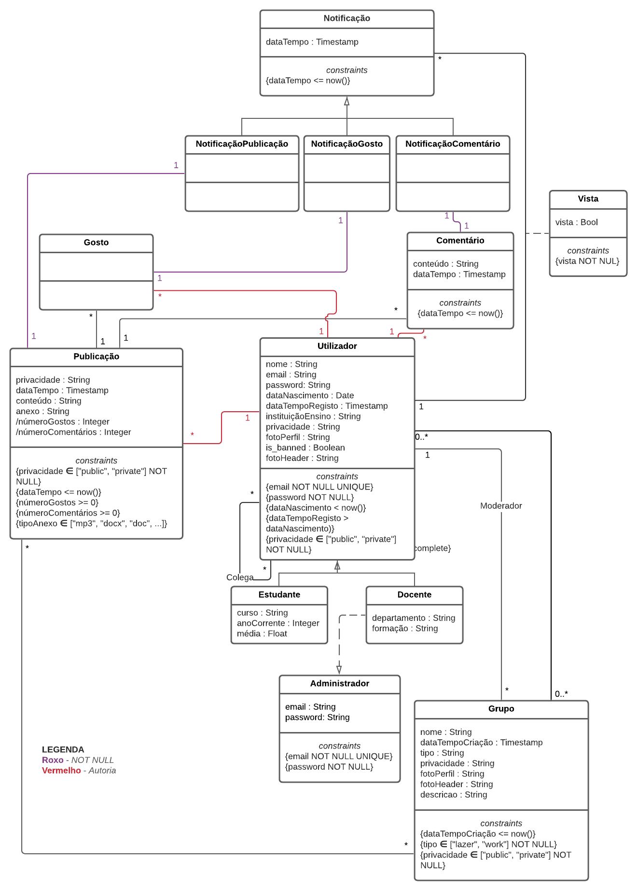

# EBD - Especificação da Base de Dados

28 de novembro de 2021

## Tema Geral

Social Networks

## **Autores**

Cristina Pêra

Luís Soares

Mateus Silva

Melissa Silva

## A4: Modelo Conceptual de Dados <sup>[1.1-1.2]</sup>

Esta componente visa a modelação inicial do sistema a utilizar para a base de dados da plataforma em desenvolvimento, procurando conceptualizá-la por meio de classes, os seus respetivos atributos e as suas interconexões.

### Modelo UML <sup>[2.1-2.6, 3.1-3.4, 4.1-4.8]</sup>



### Restrições Adicionais

1. Os atributos ***númeroGostos*** e ***númeroComentários*** são derivados e implementados a partir de gatilhos/*triggers*.

## A5: Esquema Relacional, Validação e Refinamento do Esquema

Esta componente visa a elaboração de um esquema relacional partindo do *UML* da componente **A4**, a sua subsequente validação e, se necessário, a sua normalização.

### Esquema Relacional

| Código da Relação |                          Cabeçalho                           |
| :---------------: | :----------------------------------------------------------: |
|        R01        | users(<ins>id</ins>, nome, email **UK** **NN**, password **NN**, dataNascimento **CK** dataNascimento < now(),<br />dataTempoRegisto **CK** dataTempoRegisto > dataNascimento, atualizado, instituiçãoEnsino, <br />privacidade **NN CK** privacidade **IN** PRIVACIDADE, fotoPerfil, is_banned, fotoHeader) |
|        R02        | utilizadorEstudante(<ins>id </ins>-> users.id, curso, anoCorrente, média) |
|        R03        | utilizadorDocente(<ins>id </ins>-> users.id, departamento, formação) |
|        R04        | administrador(<ins>id</ins>, email **UK** **NN**, password **NN**, idDocente->utilizadorDocente.id) |
|        R05        | grupo(<ins>id</ins>, nome, dataTempoCriação **CK** dataTempoCriação ≤ now(), atualizado, tipo **NN CK** tipo **IN** TIPO_GRUPO, privacidade **NN CK** privacidade **IN** PRIVACIDADE, fotoPerfil, fotoHeader, descricao, moderador->users.id **NN**) |
|        R06        | grupoUtilizador(<ins>id</ins>, idGrupo -> grupo.id **NN**, idUtilizador -> users.id **NN **<br/>**UK**(idGrupo, idUtilizador), tipo_pedido **NN** **CK** tipo_pedido **IN** TIPO_PEDIDO, dataTempoCriação, atualizado) |
|        R07        | notificação(<ins>id</ins>, tipo **NN** **CK** tipo in TIPO_NOTIFICAÇÃO, dataTempo **CK** (dataTempo ≤ now()), atualizado, idUtilizador->users.id, idPoster->users.id, idPublicação->publicacao.id, idComentario->comentario.id, idGosto->gosto.id, vista **NN**) |
|        R08        | gosto(<ins>id</ins>, dataTempoCriação, atualizado,<br />idUtilizador -> users.id, idPublicação -> publicação.id, idComentario->comentario.id) |
|        R09        | publicação(<ins>id</ins>, privacidade **NN** **CK** privacidade **IN** PRIVACIDADE,<br/>dataTempo **CK** dataTempo ≤ now(), atualizado, númeroGostos **CK** númeroGostos >= 0, númeroComentários **CK** númeroComentários >= 0, conteúdo, anexo, idUtilizador->users.id, idGrupo->grupo.id) |
|        R10        | comentário(<ins>id</ins>, dataTempo **CK** dataTempo ≤ now(), atualizado,<br /> idUtilizador ->users.id,<br />idPublicação -> publicação.id, conteúdo) |
|        R11        | colega(<ins>id</ins>,utilizador1->users.id, utilizador2->users.id,  tipo_pedido **NN** **CK** tipo_pedido **IN** TIPO_PEDIDO, **UK**(utilizador1, utilizador2)) |
|        R12        | password_resets(<ins>id</ins>, email **NN**, token **NN** **UK**, created_at) |

**Legenda**

- UK = UNIQUE KEY;
- NN = NOT NULL;
- CK = CHECK;
- DF = DEFAULT;

**Domínios**

| ETIQUETA         | VALORES                                    |
| ---------------- | ------------------------------------------ |
| PRIVACIDADE      | ENUM ('public', 'private')                 |
| TIPO_GRUPO       | ENUM ('lazer', 'work')                     |
| TIPO_NOTIFICAÇÃO | ENUM ('like', 'comment', 'post')           |
| TIPO_PEDIDO      | ENUM('pending', 'confirmed', 'group_join') |

### **Validação do Esquema**

Procederemos, então, à validação do esquema através do estudo das suas dependências funcionais, além de verificarmos, também através destas, se as nossas relações se encontram na *Forma Normal de Boyce-Codd* (BCNF).

| **Tabela R01** (users)                                       |
| ------------------------------------------------------------ |
| **Chaves**: {id}                                             |
| **Dependências Funcionais**                                  |
| FD0101 {id} -> {nome, email, password, dataNascimento, dataTempoRegisto, atualizado, instituiçãoEnsino, privacidade, fotoPerfil, is_banned, fotoHeader} |
| **Forma Normal**: BCNF                                       |

| **Tabela R02** (utilizadorEstudante)       |
| ------------------------------------------ |
| **Chaves**: {id}                           |
| **Dependências Funcionais**                |
| FD0201 {id} -> {curso, anoCorrente, média} |
| **Forma Normal**: BCNF                     |

| Tabela R03 (utilizadorDocente)          |
| --------------------------------------- |
| **Chaves**: {id}                        |
| **Dependências Funcionais**             |
| FD0301 {id} -> {departamento, formação} |
| **Forma Normal**: BCNF                  |

| Tabela R04 (administrador)                  |
| ------------------------------------------- |
| **Chaves**: {id}                            |
| **Dependências Funcionais**                 |
| FD0401 {id} -> {email, password, idDocente} |
| **Forma Normal**: BCNF                      |

| Tabela R05 (grupo)                                           |
| ------------------------------------------------------------ |
| **Chaves**: {id}                                             |
| **Dependências Funcionais**                                  |
| FD0501 {id} -> {nome, dataTempoCriação, atualizado, tipo, privacidade, fotoPerfil, fotoHeader, descricao, moderador} |
| **Forma Normal**: BCNF                                       |

| Tabela R06 (grupoUtilizador)                                 |
| ------------------------------------------------------------ |
| **Chaves**: {id}                                             |
| **Dependências Funcionais**                                  |
| FD0601 {id}->{idUtilizador, idGrupo, tipo_pedido, dataTempoCriacao, atualizado} |
| **Forma Normal**: BCNF                                       |

| Tabela R07 (notificação)            |
| ------------------------------------ |
| **Chaves**: {id}                     |
| **Dependências Funcionais**          |
| FD0701 {id}->{tipo, dataTempo, atualizado, idUtilizador, idPoster, idPublicacao, idComentario, idGosto, vista} |
| **Forma Normal**: BCNF               |

| Tabela R08 (gosto)                                           |
| ------------------------------------------------------------ |
| **Chaves**: {id}                                             |
| **Dependências Funcionais**                                  |
| FD0801 {id}->{idComentario, idUtilizador, idPublicação, dataTempoCriacao, atualizado} |
| **Forma Normal**: BCNF                                       |

| Tabela R09 (publicação)                                      |
| ------------------------------------------------------------ |
| **Chaves**: {id}                                             |
| **Dependências Funcionais**                                  |
| FD0901 {id}->{atualizado, privacidade, dataTempo, númeroGostos, númeroComentários, conteúdo, anexo, idUtilizador, idGrupo} |
| **Forma Normal**: BCNF                                       |

| Tabela R10 (comentário)                                      |
| ------------------------------------------------------------ |
| **Chaves**: {id}                                             |
| **Dependências Funcionais**                                  |
| FD1001 {id} -> {dataTempo, atualizado, idUtilizador, idPublicação, conteúdo} |
| **Forma Normal**: BCNF                                       |

| Tabela R11 (colega) |
| -------------------------------- |
| **Chaves**: {id}       |
| **Dependências Funcionais**      |
| FD1101 {id}-> {utilizador1, utilizador2, tipo_pedido} |
| **Forma Normal**: BCNF           |

| Tabela R12 (password_resets)            |
| --------------------------------------- |
| **Chaves**: {id}                        |
| **Dependências Funcionais**             |
| FD1201 {id}->{email, token, created_at} |
| **Forma Normal**: BCNF                  |

Todas as dependências funcionais não triviais de cada relação (A->B, A é uma (*super*) key), logo todas as relações se encontrarem na *Forma Normal de Boyce-Codd* (BCNF), podemos dizer que o esquema se encontra, também, em *BCNF*, pelo que não precisa de ser normalizado.

## A6: Índices, *Triggers* e População da Base de Dados

### Carga de Trabalho (*Workload*)

| **Relação** |    Nome da Relação    | Ordem de Magnitude | Crescimento Esperado |
| :---------: | :-------------------: | :----------------: | :------------------: |
|     R01     |     *utilizador*      |   12m (milhares)   |       3000/dia       |
|     R02     | *utilizadorEstudante* |        10m         |       2000/dia       |
|     R03     |  *utilizadorDocente*  |         2m         |       1000/dia       |
|     R04     |    *administrador*    |        0.1m        |        10/ano        |
|     R05     |        *grupo*        |        2.5m        |        2/dia         |
|     R06     |     *notificação*     |   22M (milhões)    |       5.5m/dia       |
|     R08     |        *gosto*        |        600m        |        2m/dia        |
|     R09     |     *publicação*      |        85m         |       170/dia        |
|     R10     |     *comentário*      |         1M         |       2.5m/dia       |
|     R11     |       *colega*        |        2.4m        |       100/dia        |
|     R12     |   *password_resets*   |       0.06m        |        2/dia         |

### Índices Propostos

Para a melhoria da performance da base de dados associada ao nosso modelo relacional, propomos os índices seguintes. Possuímos três índices de perfomance e três do tipo *full-text search*.

#### Índices de *Performance*

| **Índice**             | *IDX01*                                                      |
| ---------------------- | ------------------------------------------------------------ |
| **Relações do Índice** | *publicação*                                                 |
| **Atributo Indexado**  | *privacidade*                                                |
| **Tipo do Índice**     | B-Tree                                                       |
| **Cardinalidade**      | Baixa                                                        |
| **Clustering**         | Não                                                          |
| **Justificação**       | A exibição de um perfil é uma ação frequente e que requer a busca de todas as publicações públicas de um utilizador. Portanto, criámos um índice onde filtramos as publicações pelo atributo *privacidade*, de modo a tornar a busca por publicações públicas mais rápida. Apesar de se tratar de uma ação de filtragem, não é possível usar aqui o hash devido ao atributo *privacidade* só ter dois valores possíveis: *public* e *private*, não havendo assim a distinção necessária para fazer uma função de hash. |
| **Código SQL**         | CREATE INDEX public_posts  ON publicacao(privacidade)  WHERE privacidade = 'public'; |

#### Índices do tipo *full-text search*

| **Índice**             | IDX11                                                        |
| ---------------------- | ------------------------------------------------------------ |
| **Relações do Índice** | *utilizador*                                                 |
| **Atributo Indexado**  | *nome*                                                       |
| **Tipo do Índice**     | GIN                                                          |
| **Clustering**         | Não                                                          |
| **Justificação**       | Proporciona funcionalidades *full-text search* para procurar por utilizadores usando o seu nome. O tipo de índice é GIN porque não se espera que o atributo indexado mude com frequência. |
| **Código SQL**         | ALTER TABLE utilizador<br/>ADD COLUMN tsvectors TSVECTOR;<br/><br/>CREATE FUNCTION utilizador_search_update()<br/>RETURNS TRIGGER AS $$<br/>BEGIN <br/> IF TG_OP = 'INSERT' THEN <br/>      NEW.tsvectors = (setweight(to_tsvector('portuguese',NEW.nome),'A'));<br/> END IF;<br/> IF TG_OP = 'UPDATE' THEN <br/>          IF (NEW.nome <> OLD.nome) THEN <br/>               NEW.tsvectors = (setweight(to_tsvector('portuguese',NEW.nome),'A'));<br/>          END IF;<br/> END IF;<br/> RETURN NEW;<br/>END;<br/> $$<br/>LANGUAGE plpgsql;<br/><br/>CREATE TRIGGER utilizador_search_update<br/>  BEFORE INSERT OR UPDATE ON utilizador<br/>  FOR EACH ROW <br/>  EXECUTE PROCEDURE utilizador_search_update();<br/><br/>CREATE INDEX search_user <br/>ON utilizador<br/>USING GIN(tsvectors); |

| **Índice**             | IDX12                                                        |
| ---------------------- | ------------------------------------------------------------ |
| **Relações do Índice** | *grupo*                                                      |
| **Atributo Indexado**  | *nome*, *descrição*                                          |
| **Tipo do Índice**     | GIN                                                          |
| **Clustering**         | Não                                                          |
| **Justificação**       | Proporciona funcionalidades *full-text search* para procurar por grupos usando o seu nome e descrição (utilizamos pesos). O tipo de índice é GIN porque não se espera que o atributo indexado mude com frequência. |
| **Código SQL**         | ALTER TABLE grupo<br/>ADD COLUMN tsvectors TSVECTOR;<br/><br/>CREATE FUNCTION grupo_search_update()<br/>RETURNS TRIGGER AS $$<br/>BEGIN <br/>  IF TG_OP = 'INSERT' THEN NEW.tsvectors = (setweight(to_tsvector('portuguese',NEW.nome),'A') \|\| setweight(to_tsvector('portuguese',NEW.descricao),'B'));<br/> END IF;<br/><br/> IF TG_OP = 'UPDATE' THEN <br/>          IF (NEW.nome <> OLD.nome) THEN <br/>                            NEW.tsvectors = (setweight(to_tsvector('portuguese',NEW.nome),'A') \|\|setweight(to_tsvector('portuguese',NEW.descricao),'B'));<br/>          END IF;<br/> END IF;<br/> RETURN NEW;<br/>END;<br/> $$<br/>LANGUAGE plpgsql;<br/><br/>CREATE TRIGGER grupo_search_update<br/>  BEFORE INSERT OR UPDATE ON grupo<br/>  FOR EACH ROW <br/>  EXECUTE PROCEDURE grupo_search_update();<br/><br/>CREATE INDEX search_group <br/>ON grupo <br/>USING GIN(tsvectors); |

| **Índice**             | IDX13                                                        |
| ---------------------- | ------------------------------------------------------------ |
| **Relações do Índice** | *publicação*                                                 |
| **Atributo Indexado**  | *conteúdo*                                                   |
| **Tipo do Índice**     | GiST                                                         |
| **Clustering**         | Não                                                          |
| **Justificação**       | Proporciona funcionalidades *full-text search* para procurar por publicações usando o seu conteúdo (termos incluídos neste). O tipo de índice é GiST porque espera-se que os atributos indexados mudem com frequência, pois a tabela *publicação* recebe novas adições frequentemente. |
| **Código SQL**         | ALTER TABLE publicacao<br/>ADD COLUMN tsvectors TSVECTOR;<br/><br/>CREATE FUNCTION post_search_update()<br/>RETURNS TRIGGER AS $$<br/>BEGIN <br/> IF TG_OP = 'INSERT' THEN NEW.tsvectors = setweight(to_tsvector('portuguese',NEW.conteudo),'A')); <br/>END IF; <br/> IF TG_OP = 'UPDATE' THEN <br/>          IF (NEW.conteudo <> OLD.conteudo) THEN <br/>                       NEW.tsvectors = (setweight(to_tsvector('portuguese',NEW.conteudo),'A'));<br/>          END IF;<br/> END IF;<br/> RETURN NEW;<br/>END;<br/> $$<br/>LANGUAGE plpgsql;<br/><br/>CREATE TRIGGER post_search_update<br/>  BEFORE INSERT OR UPDATE ON publicacao<br/>  FOR EACH ROW <br/>  EXECUTE PROCEDURE post_search_update();<br/><br/>CREATE INDEX search_post<br/> ON publicacao<br/> USING GiST(tsvectors); |

| **Índice**             | IDX14                                                        |
| ---------------------- | ------------------------------------------------------------ |
| **Relações do Índice** | *comentário*                                                 |
| **Atributo Indexado**  | *conteúdo*                                                   |
| **Tipo do Índice**     | GiST                                                         |
| **Clustering**         | Não                                                          |
| **Justificação**       | Proporciona funcionalidades *full-text search* para procurar por comentários usando o seu conteúdo (termos incluídos neste). O tipo de índice é GiST porque espera-se que os atributos indexados mudem com frequência, pois a tabela *comentário* recebe novas adições frequentemente. |
| **Código SQL**         | ALTER TABLE comentario<br>ADD COLUMN tsvectors TSVECTOR;<br><br>CREATE OR REPLACE FUNCTION comment_search_update()<br>RETURNS TRIGGER AS $$<br>BEGIN<br> IF TG_OP = 'INSERT' THEN NEW.tsvectors = (setweight(to_tsvector('portuguese',NEW.conteudo),'A')); <br>END IF; <br><br>IF TG_OP = 'UPDATE' THEN <br>IF (NEW.conteudo <> OLD.conteudo) THEN <br>NEW.tsvectors = (setweight(to_tsvector('portuguese',NEW.conteudo),'A'));<br>END IF;<br>END IF;<br>RETURN NEW;<br>END;<br>$$<br>LANGUAGE plpgsql;<br><br>CREATE TRIGGER comment_search_update<br>BEFORE INSERT OR UPDATE ON comentario<br>FOR EACH ROW <br>EXECUTE PROCEDURE comment_search_update();<br><br>CREATE INDEX search_comment <br>ON comentario<br>USING GiST(tsvectors); |

### *Triggers*

| *Trigger*      | TRIGGER01                                                    |
| -------------- | ------------------------------------------------------------ |
| **Descrição**  | Cada vez que um utilizador gosta de uma publicação, o valor no atributo *númeroGostos* da sua entrada deve ser incrementado. Este trigger serve para implementar uma das **Restrições Adicionais** que não eram possíveis de representar no UML. |
| **Código SQL** | CREATE FUNCTION num_likes() <br/>RETURNS TRIGGER AS <br/>$$ <br/>BEGIN<br/>         UPDATE publicacao<br/>         SET<br/>             númeroGostos = IFNULL(númeroGostos, 0) + 1<br/>         WHERE id = new.publicacao;<br/>END $$ <br/>LANGUAGE plpgsql;<br/><br/>CREATE TRIGGER num_likes <br/>               AFTER INSERT ON gosto<br/>               FOR EACH ROW<br/>               EXECUTE PROCEDURE num_likes(); |

| *Trigger*      | TRIGGER02                                                    |
| -------------- | ------------------------------------------------------------ |
| **Descrição**  | Cada vez que um utilizador comenta numa publicação, o atributo *númeroComentários* desta deve ser incrementado. Este *trigger* serve para implementar uma das **Restrições Adicionais** que não eram possíveis de representar no UML. |
| **Código SQL** | CREATE FUNCTION num_comments()<br/>RETURNS TRIGGER AS <br/>$$ <br/>BEGIN<br/>         UPDATE publicacao<br/>          SET<br/>             númeroComentários = IFNULL(númeroComentários, 0) + 1<br/>         WHERE id = new.publicacao;<br/>END;<br/>$$<br/>LANGUAGE plpgsql;<br/><br/>CREATE TRIGGER num_comments <br/>               AFTER INSERT ON comentário<br/>               FOR EACH ROW<br/>               EXECUTE PROCEDURE num_comments(); |

### *Transações*

Nesta secção, apresentaremos e defenderemos todas as transações elaboradas para garantir a consistência da nossa base de dados, explicando ainda a motivação para as termos criado.

| **Transação**         | TRAN01                                                       |
| --------------------- | ------------------------------------------------------------ |
| **Descrição**         | Inserção de uma nova publicação com o atributo privacidade correto. |
| **Justificação**      | Para garantir as *BR01* e *BR02*, as publicações precisam de ter o seu atributo<br />privacidade com o mesmo valor do mesmo atributo em utilizador e grupo. Se um utilizador for privado, todas as suas publicações serão privadas, a menos que pertença a algum grupo público, aí todas as publicações que faz nesse grupo, serão públicas.<br />O nível de isolação é *Repeatable Read* porque caso contrário, podiam ocorrer<br />inserções por obra de transações concorrentes e como resultado, dados<br />inconsistentes teriam sido guardados. |
| **Nível de Isolação** | REPEATABLE READ                                              |
| **Código SQL**        | CREATE OR REPLACE PROCEDURE constant_privacy<br/>(<br/> idU integer,<br/> idN integer,<br/>dT timestamp,<br/>c text,<br/>a text,<br/>tA tipoAnexo,<br/>idG integer,<br/>idP integer<br/>)<br/>LANGUAGE plpgsql<br/>AS<br/>$$<br/>DECLARE <br/>   p_t privacidade;<br/><br/>BEGIN<br/>--Antes de inserir em publicação vamos ver como é a privacidade no utilizador<br/>p_t := (SELECT privacidade FROM utilizador<br/><br/>INSERT INTO publicacao(idNotificacao,privacidade,dataTempo,conteudo,anexo,tipoAnexo,idUtilizador)  VALUES(idN,p_t,dT,c,a,tA,idU);<br/><br/>--Caso seja uma publicação para um grupo, esta fica com a privacidade do grupo<br/>p_t := (SELECT privacidade FROM grupo WHERE id=idG);<br/><br/>UPDATE publicacao<br/>     SET <br/>         privacidade = p_t<br/>    WHERE<br/>         id=idP;<br/><br/>END<br/>$$; |

#### **Anexo A - Código SQL**

```sql
CREATE SCHEMA IF NOT EXISTS lbaw2152;

SET search_path TO lbaw2152;

DROP TABLE IF EXISTS password_resets CASCADE; 
DROP TABLE IF EXISTS gosto CASCADE;
DROP TABLE IF EXISTS grupoutilizador CASCADE;
DROP TABLE IF EXISTS grupo CASCADE;
DROP TABLE IF EXISTS moderador CASCADE;
DROP TABLE IF EXISTS comentario CASCADE;
DROP TABLE IF EXISTS notificacao CASCADE;
DROP TABLE IF EXISTS publicacao CASCADE;
DROP TABLE IF EXISTS administrador CASCADE;
DROP TABLE IF EXISTS colega CASCADE;
DROP TABLE IF EXISTS utilizadordocente CASCADE;
DROP TABLE IF EXISTS utilizadorestudante CASCADE;
DROP TABLE IF EXISTS users CASCADE;

DROP TYPE IF EXISTS privacidade CASCADE;
DROP TYPE IF EXISTS tipogrupo CASCADE;
DROP TYPE IF EXISTS tiponotificacao CASCADE;
DROP TYPE IF EXISTS tipopedido CASCADE;

CREATE TYPE privacidade AS ENUM ('public', 'private');
CREATE TYPE tipogrupo AS ENUM ('lazer', 'work');
CREATE TYPE tiponotificacao AS ENUM ('like', 'comment', 'post');
CREATE TYPE tipopedido AS ENUM ('pending','confirmed','group_join');

CREATE TABLE users (
    id serial PRIMARY KEY,
    nome text,
    email text NOT NULL UNIQUE,
    password text NOT NULL,
    dataNascimento timestamp CONSTRAINT notBornYesterday CHECK (dataNascimento <now()::timestamp),
    dataTempoRegisto timestamp CONSTRAINT notRegisteredYesterday CHECK (dataTempoRegisto > dataNascimento),
    atualizado timestamp,
    instituicaoEnsino text,
    privacidade privacidade NOT NULL,
    fotoPerfil text,
    is_banned boolean,
    fotoHeader text
);

CREATE TABLE utilizadorestudante (
    id serial PRIMARY KEY REFERENCES users ON DELETE CASCADE ON UPDATE CASCADE,
    curso text, 
    anoCorrente integer,
    media float
);

CREATE TABLE utilizadordocente (
    id serial PRIMARY KEY REFERENCES users ON DELETE CASCADE ON UPDATE CASCADE,
    departamento text, 
    formacao text
);

CREATE TABLE password_resets(
  id serial PRIMARY KEY,
  email text NOT NULL,
  token text NOT NULL UNIQUE,
  created_at timestamp
);

CREATE TABLE grupo (
    id serial PRIMARY KEY,
    nome text,
    dataTempoCriacao timestamp,
    atualizado timestamp,
    privacidade privacidade NOT NULL,
    tipo tipoGrupo NOT NULL,
    fotoPerfil text,
    fotoHeader text,
    descricao text,
    moderador integer NOT NULL REFERENCES users(id) ON DELETE CASCADE ON UPDATE CASCADE,
    CONSTRAINT notCreatedYesterday CHECK (dataTempoCriacao <= now()::timestamp)
);

CREATE TABLE administrador (
    id serial PRIMARY KEY,
    email text UNIQUE NOT NULL,
    password text NOT NULL,
    idDocente integer REFERENCES utilizadorDocente(id) ON DELETE CASCADE ON UPDATE CASCADE
);

CREATE TABLE grupoUtilizador (
    id serial PRIMARY KEY,
    idUtilizador integer NOT NULL REFERENCES users (id) ON DELETE CASCADE ON UPDATE CASCADE,
    idGrupo integer NOT NULL REFERENCES grupo (id) ON DELETE CASCADE ON UPDATE CASCADE,
    tipo_pedido tipopedido NOT NULL,
    dataTempoCriacao timestamp,
    atualizado timestamp,
    UNIQUE (idUtilizador, idGrupo)
);

CREATE TABLE publicacao (
    id serial PRIMARY KEY,
    dataTempo timestamp CONSTRAINT notPostedYesterday CHECK (dataTempo <= now()::timestamp),
    numeroGostos integer,
    atualizado timestamp,
    numeroComentarios integer,
    conteudo text,
    anexo text,
    idUtilizador integer REFERENCES users(id)ON DELETE SET NULL ON UPDATE CASCADE,
    idGrupo integer REFERENCES grupo(id) ON DELETE SET NULL ON UPDATE CASCADE,
    privacidade privacidade NOT NULL,
    CONSTRAINT positiveLikes CHECK (numeroGostos >= 0),
    CONSTRAINT positiveComments CHECK (numeroComentarios >= 0)
);

CREATE TABLE comentario (
    id serial PRIMARY KEY,
    dataTempo timestamp,
    atualizado timestamp,
    conteudo text,
    idUtilizador integer REFERENCES users(id) ON DELETE SET NULL ON UPDATE CASCADE,
    idPublicacao integer REFERENCES publicacao(id) ON DELETE CASCADE ON UPDATE CASCADE,
    CONSTRAINT notCommentedYesterday CHECK (dataTempo <= now()::timestamp)
);

CREATE TABLE gosto (
    id serial PRIMARY KEY,
    dataTempoCriacao timestamp,
    atualizado timestamp,
    idUtilizador integer REFERENCES users(id) ON DELETE SET NULL ON UPDATE CASCADE,
    idPublicacao integer REFERENCES publicacao(id) ON DELETE CASCADE ON UPDATE CASCADE,
    idComentario integer REFERENCES comentario(id) ON DELETE CASCADE ON UPDATE CASCADE
);

CREATE TABLE notificacao (
    id serial PRIMARY KEY,
    dataTempo timestamp,
    atualizado timestamp,
    tipo tipoNotificacao NOT NULL,
    idUtilizador integer NOT NULL REFERENCES users (id) ON DELETE CASCADE ON UPDATE CASCADE,
    idPoster integer REFERENCES users(id) ON DELETE CASCADE ON UPDATE CASCADE,
    idPublicacao integer REFERENCES publicacao(id) ON DELETE CASCADE ON UPDATE CASCADE,
    idComentario integer REFERENCES comentario(id) ON DELETE CASCADE ON UPDATE CASCADE,
    idGosto integer REFERENCES gosto(id) ON DELETE CASCADE ON UPDATE CASCADE,
    vista boolean NOT NULL,
    CONSTRAINT notNotifiedYesterday CHECK (dataTempo <= now()::timestamp)
);

CREATE TABLE colega (
    id serial PRIMARY KEY,
    utilizador1 integer REFERENCES users(id) ON DELETE CASCADE ON UPDATE CASCADE,
    utilizador2 integer REFERENCES users(id) ON DELETE CASCADE ON UPDATE CASCADE,
    tipo_pedido tipopedido NOT NULL,
    UNIQUE (utilizador1, utilizador2)
);

--INDEXES PERFORMANCE
DROP INDEX IF EXISTS public_posts CASCADE;
DROP INDEX IF EXISTS group_posts CASCADE;
DROP INDEX IF EXISTS user_posts CASCADE;
DROP INDEX IF EXISTS search_user CASCADE;
DROP INDEX IF EXISTS search_group CASCADE;
DROP INDEX IF EXISTS search_post CASCADE;
DROP INDEX IF EXISTS search_comment CASCADE;

--IDX01
CREATE INDEX public_posts 
ON publicacao(privacidade) 
WHERE privacidade = 'public';

--INDEXES FULL-TEXT SEARCH
--IDX11
ALTER TABLE users
ADD COLUMN tsvectors TSVECTOR;

DROP FUNCTION IF EXISTS utilizador_search_update() CASCADE;
CREATE FUNCTION utilizador_search_update()
RETURNS TRIGGER AS $$
BEGIN 
 IF TG_OP = 'INSERT' THEN
    NEW.tsvectors = (setweight(to_tsvector('portuguese',NEW.nome),'A'));
 END IF;
 
 IF TG_OP = 'UPDATE' THEN 
    IF (NEW.nome <> OLD.nome) THEN 
        NEW.tsvectors = (setweight(to_tsvector('portuguese',NEW.nome),'A'));
    END IF;
 END IF;
 RETURN NEW;
END;
$$
LANGUAGE plpgsql;

DROP TRIGGER IF EXISTS utilizador_search_update ON utilizador;
CREATE TRIGGER utilizador_search_update
BEFORE INSERT OR UPDATE ON users
FOR EACH ROW
EXECUTE PROCEDURE utilizador_search_update();

CREATE INDEX search_user 
ON users
USING GIN(tsvectors);

--IDX12
ALTER TABLE grupo
ADD COLUMN tsvectors TSVECTOR;

CREATE OR REPLACE FUNCTION grupo_search_update()
RETURNS TRIGGER AS $$
BEGIN 
 IF TG_OP = 'INSERT' THEN NEW.tsvectors = (setweight(to_tsvector('portuguese',NEW.nome),'A') || setweight(to_tsvector('portuguese',NEW.descricao),'B'));
 END IF;
 
 IF TG_OP = 'UPDATE' THEN
    IF (NEW.nome <> OLD.nome) THEN 
        NEW.tsvectors = (setweight(to_tsvector('portuguese',NEW.nome),'A') || setweight(to_tsvector('portuguese',NEW.descricao),'B'));
    END IF;
 END IF;
 RETURN NEW;
END;
$$
LANGUAGE plpgsql;

DROP TRIGGER IF EXISTS grupo_search_update on grupo;
CREATE TRIGGER grupo_search_update
BEFORE INSERT OR UPDATE ON grupo
FOR EACH ROW 
EXECUTE PROCEDURE grupo_search_update();

CREATE INDEX search_group 
ON grupo 
USING GIN(tsvectors);

--IDX13
ALTER TABLE publicacao
ADD COLUMN tsvectors TSVECTOR;

CREATE OR REPLACE FUNCTION post_search_update()
RETURNS TRIGGER AS $$
BEGIN 
  IF TG_OP = 'INSERT' THEN NEW.tsvectors = (setweight(to_tsvector('portuguese',NEW.conteudo),'A')); 
  END IF; 
  
  IF TG_OP = 'UPDATE' THEN 
    IF (NEW.conteudo <> OLD.conteudo) THEN 
        NEW.tsvectors = (setweight(to_tsvector('portuguese',NEW.conteudo),'A'));
    END IF;
  END IF;
  RETURN NEW;
END;
$$
LANGUAGE plpgsql;

CREATE TRIGGER post_search_update
BEFORE INSERT OR UPDATE ON publicacao
FOR EACH ROW 
EXECUTE PROCEDURE post_search_update();

CREATE INDEX search_post 
ON publicacao 
USING GiST(tsvectors);

--IDX14
ALTER TABLE comentario
ADD COLUMN tsvectors TSVECTOR;

CREATE OR REPLACE FUNCTION comment_search_update()
RETURNS TRIGGER AS $$
BEGIN 
  IF TG_OP = 'INSERT' THEN NEW.tsvectors = (setweight(to_tsvector('portuguese',NEW.conteudo),'A')); 
  END IF; 
  
  IF TG_OP = 'UPDATE' THEN 
    IF (NEW.conteudo <> OLD.conteudo) THEN 
        NEW.tsvectors = (setweight(to_tsvector('portuguese',NEW.conteudo),'A'));
    END IF;
  END IF;
  RETURN NEW;
END;
$$
LANGUAGE plpgsql;

CREATE TRIGGER comment_search_update
BEFORE INSERT OR UPDATE ON comentario
FOR EACH ROW 
EXECUTE PROCEDURE comment_search_update();

CREATE INDEX search_comment 
ON comentario
USING GiST(tsvectors);

--TRIGGERS
--TRIGGER01
DROP TRIGGER IF EXISTS num_likes ON gosto CASCADE;
DROP FUNCTION IF EXISTS num_likes();
CREATE FUNCTION num_likes() 
RETURNS TRIGGER AS 
$$ 
BEGIN
    UPDATE publicacao
    SET 
      numeroGostos = coalesce(publicacao.numeroGostos, 0) + 1
    WHERE id = new.id;
    
    RETURN NEW;
END $$
LANGUAGE plpgsql;

CREATE TRIGGER num_likes 
        AFTER INSERT ON gosto
        FOR EACH ROW
        EXECUTE PROCEDURE num_likes();

--TRIGGER02
DROP TRIGGER IF EXISTS num_comments ON comentario CASCADE;
DROP FUNCTION IF EXISTS num_comments();
CREATE FUNCTION num_comments()
RETURNS TRIGGER AS 
$$ 
BEGIN
    UPDATE publicacao
    SET 
      numeroComentarios = coalesce(publicacao.numeroComentarios, 0) + 1
    WHERE id = new.id;

    RETURN NEW;
END;
$$
LANGUAGE plpgsql;

CREATE TRIGGER num_comments
       AFTER INSERT ON comentario
       FOR EACH ROW
       EXECUTE PROCEDURE num_comments();


--TRAN01
CREATE OR REPLACE PROCEDURE constant_privacy
(
  idU integer,
  idN integer,
  dT timestamp,
  c text,
  a text,
  idG integer,
  idP integer
)
LANGUAGE plpgsql
AS
$$
DECLARE
   p_t privacidade;
BEGIN
--Antes de inserir em publicação vamos ver como é a privacidade no utilizador
p_t := (SELECT privacidade FROM users
WHERE id=idU);

INSERT INTO publicacao(privacidade,dataTempo,conteudo,anexo,idUtilizador)   VALUES(p_t,dT,c,a,idU);

END 
$$;
```

#### Anexo B - Povoação

```sql
INSERT INTO users (nome,email,password,dataNascimento,dataTempoRegisto,instituicaoEnsino, privacidade, fotoPerfil, is_banned, fotoHeader)
VALUES
  ('Brianna Cortez','test@gmail.com','$2a$12$.yaBVBBYK4mlw2YYqsB3uOU9gjsosB/8kakpdEtWRbKo663iKBhMa','2001-10-20 00:00:00','2021-10-01 00:00:00','FEUP', 'public','assets/img/avatar47.jpg',FALSE,'assets/img/banner.jpg'),
  ('Macaulay Wilson','test_noodle@outlook.com','$2a$12$oF7JH.IzxV5eBOM/Z5SarOqId1Rs320vi6D8DclslKGHScqckLqm6,','2002-12-22 00:00:00','2021-10-01 00:00:00','FEUP', 'public','assets/img/avatar2.jpg',FALSE,'assets/img/banner2.jpg'),
  ('MacKenzie Jensen','test3@gmail.com','$2a$12$TuHtNkrP4gQ39n4GfrAMVey.pp8IEHlf82UsY6U2D0BZjZPgGuYdq','2001-11-10 00:00:00','2021-10-01 00:00:00','FEUP', 'public','assets/img/avatar3.jpg',FALSE,'assets/img/banner3.png'),
  ('Philip Howell','fringilla.porttitor.vulputate@aol.couk','$2a$12$CUNnCTVqUeJw9R.FfrKxNOP8LKbXq3GXfkSJA.PKPyiLpw2uVtg7e','2002-01-01 00:00:00','2021-10-01 00:00:00','FEUP', 'public','assets/img/avatar4.jpg',FALSE,'assets/img/banner4.png'),
  ('Ignatius Puckett','eget@hotmail.ca','$2a$12$clHq0ogcSQi8tT1a6GqDee4eBDOTVsf4xX1U/OZ93iMf.53wH3/cC','2001-03-23 00:00:00','2021-10-01 00:00:00','FEUP', 'public','assets/img/avatar5.jpg',FALSE,'assets/img/banner5.jpg'),
  ('Karly Cook','amet.nulla.donec@icloud.org','$2a$12$ngXZspKZCHLBs1CNhx.CZuaVm1WqFHaUf8bGaalyGwVUYB801Xcte','2001-10-30 00:00:00','2021-10-01 00:00:00','FEUP', 'public','assets/img/avatar6.jpg',FALSE,'assets/img/banner6.jpeg'),
  ('Lynn Lucas','tristique@outlook.edu','$2a$12$B35eB65gUGpK5ofkaHxEhuzuvsCPLmDEllzSbQc9.SSvEPe5PtoL6','2001-05-20 00:00:00','2021-10-01 00:00:00','FEUP', 'public','assets/img/avatar7.jpg',FALSE,'assets/img/banner7.jpeg'),
  ('Orson Peters','test4@gmail.com','$2a$12$kXftfSg3hFg90Xs9GU3Yh.vr5DT3kFflKEIIwJDhByxDLQmxjGvHm','2003-04-20 00:00:00','2021-10-01 00:00:00','FEUP', 'public','assets/img/avatar8.jpg',FALSE,'assets/img/banner8.jpeg'),
  ('Iliana Le','sed.id@outlook.com','$2a$12$yb9EekoL2p7oqj0g44LlB.29uwlCoZ4OEPwlZdQQ9Ec0I9QLZyEr6','2001-09-30 00:00:00','2021-10-01 00:00:00','FEUP', 'public','assets/img/avatar9.jpg',FALSE,'assets/img/banner9.jpeg'),
  ('Alexis Jacobs','test2@gmail.com','$2a$12$UwxKJb1rb9fARxElewmoFeGx7l4V5nyh8mzj.UgPExQMJ0.0G8szy','2002-01-19 00:00:00','2021-10-01 00:00:00','FEUP', 'public','assets/img/avatar10.jpg',FALSE,'assets/img/banner10.jpeg');
INSERT INTO users (nome,email,password,dataNascimento,dataTempoRegisto,instituicaoEnsino, privacidade, fotoPerfil, is_banned, fotoHeader)
VALUES
  ('Scarlet Smith','test5@gmail.com','$2a$12$GXIEYfCYYwMlLjww6TGAW.dwntvINgqr/eXBsf2ynw6/1R5KnLFtG','2001-03-24 00:00:00','2021-10-01 00:00:00','FEUP', 'public','assets/img/avatar11.jpg',FALSE,'assets/img/banner11.jpeg'),
  ('Phillip Mayo','eget@yahoo.net','$2a$12$pH2/LEEWeFWE4/jfOj8f..kUBw.hpa7XyloR9P77iHgvbhslIwtte','2001-04-29 00:00:00','2021-10-01 00:00:00','FEUP', 'public','assets/img/avatar12.png',FALSE,'assets/img/banner12.jpeg'),
  ('Fallon Burch','dolor.dapibus@aol.edu','$2a$12$1jHvIh335638lt312uT.z.QJIFL7P4h48MXKtjgsBkkodVbtgI9H6','2001-02-20 00:00:00','2021-10-01 00:00:00','FEUP', 'public','assets/img/avatar13.jpg',FALSE,'assets/img/banner13.jpeg'),
  ('Dexter Mccullough','test6@gmail.com','$2a$12$TtGriWDLx1oKbC3eyhkOn.gy3Dw7jJE9wZQC1JqTMfxbVLhepZ5oO','2002-10-20 00:00:00','2021-10-01 00:00:00','FEUP', 'public','assets/img/avatar14.jpg',FALSE,'assets/img/banner14.jpeg'),
  ('Delilah Blankenship','malesuada.integer@yahoo.com','$2a$12$OCpGJVukesMDI837aPoEL.3Ol7GQHZ0OXWchWipqfl4qV9cF7QNMq','2001-12-28 00:00:00','2021-10-01 00:00:00','FEUP', 'public','assets/img/avatar15.jpg',FALSE,'assets/img/banner15.jpeg'),
  ('Luke Sheppard','nisi.nibh@protonmail.edu','$2a$12$2uFstv4F3HS.Ed2p14s6C.LWLdzHh5q1DsggpLUrHbQjJfqRMWvi.','2001-10-20 00:00:00','2021-10-01 00:00:00','FEUP', 'public','assets/img/avatar16.jpg',FALSE,'assets/img/banner16.jpeg'),
  ('Miranda Carson','ornare@outlook.ca','$2a$12$P5zXs9u9Ekd4lE0ugCy7vOjIg4Jgu6Y78OeTxaSOBE1VdYBgAQl4G','2003-02-22 00:00:00','2021-10-01 00:00:00','FEUP', 'public','assets/img/avatar17.jpg',FALSE,'assets/img/banner17.jpeg'),
  ('Francis Roberts','sociis.natoque@icloud.org','$2a$12$CKWl.Iyx4tIqGTUD.JGXJuKpQl.7rMtqjx9es3gWsodblQ/ggOETe','2001-07-21 00:00:00','2021-10-02 00:00:00','FEUP', 'public','assets/img/avatar18.jpg',FALSE,'assets/img/banner18.jpeg'),
  ('Brynne Jackson','sollicitudin@yahoo.net','$2a$12$4gZresIGd38hLesxPxO.pO5c2iOcbXXBxaKs9V4FyIn0AjQcZZkoe','2001-05-04 00:00:00','2021-10-02 00:00:00','FEUP', 'public','assets/img/avatar19.jpg',FALSE,'assets/img/banner19.jpg'),
  ('Adrienne Acosta','nonummy@yahoo.org','$2a$12$L9OGH5TQjC2s0UhC23LXh.t7JYgqI2W4kZw2.p1zyv9l5omBskeNC','2001-08-20 00:00:00','2021-10-02 00:00:00','FEUP', 'public','assets/img/avatar20.jpg',FALSE,'assets/img/banner20.jpg');
INSERT INTO users (nome,email,password,dataNascimento,dataTempoRegisto,instituicaoEnsino, privacidade, fotoPerfil, is_banned,fotoHeader)
VALUES
  ('Britanni Espinoza','auctor.velit.aliquam@hotmail.net','$2a$12$9eCqHuCl/Ne.9wBDG2TcPOtxmHZMYlZDG61GodSlHDWaHu/57iFNG','2001-05-03 00:00:00','2021-10-02 00:00:00','FEUP', 'public','assets/img/avatar21.jpg',FALSE,'assets/img/banner21.jpg'),
  ('Ingrid Gibson','imperdiet.ornare@hotmail.couk','$2a$12$UUzONFD2c00QjYpvuX7pIuVe/sU6fSDQIWam8TwYMaNFYxRkazXle','2001-10-02 00:00:00','2021-10-02 00:00:00','FEUP', 'public','assets/img/avatar22.jpg',FALSE,'assets/img/banner22.png'),
  ('Stone Spencer','donec.felis.orci@yahoo.edu','$2a$12$6nYRHmGajJhY.k8OhzU9.umVStfC9NJyp80cnrWgjSjRurDDMrM02','2002-12-20 00:00:00','2021-10-02 00:00:00','FEUP', 'public','assets/img/avatar23.jpg',FALSE,'assets/img/banner23.jpeg'),
  ('Craig Sanford','ut.cursus@outlook.com','$2a$12$6W7pe1IBnfRgTk.wOrnFUub2vnHKtzjC2d3w3judbXAw8kqIGTNz2','2001-12-08 00:00:00','2021-10-02 00:00:00','FEUP', 'public','assets/img/avatar24.jpg',FALSE,'assets/img/banner24.jpg'),
  ('Amber Oneal','sodales.at@yahoo.couk','$2a$12$TW7FUtZKs1ZMijrydeAoCOA1uMDfNX2A6TE93JXFfG5mGFqrmMwia','2001-04-23 00:00:00','2021-10-02 00:00:00','FEUP', 'public','assets/img/avatar25.jpg',FALSE,'assets/img/banner25.jpeg'),
  ('Lewis Jackson','ultrices.sit.amet@protonmail.com','$2a$12$Nm511502cIhH4T1tkRL0TOAlshi6HP/f6mXG.FdC1JrbxE9xCxY3i','2001-10-03 00:00:00','2021-10-02 00:00:00','FEUP', 'public','assets/img/avatar26.png',FALSE,'assets/img/banner26.jpeg'),
  ('Amal Roy','aliquam.eros@yahoo.com','$2a$12$2dgeoU0k.21.Oh5KeTW50uEx9N5g4YFuHynE1J3wZFb0BLbjFPw6q','2001-10-31 00:00:00','2021-10-02 00:00:00','FEUP', 'public','assets/img/avatar27.jpg',FALSE,'assets/img/banner27.jpg'),
  ('Ramona Sanders','habitant.morbi.tristique@icloud.net','$2a$12$GagRopDd253AXvIq26MJOuPGh8KtmTr1lHmULC2OVyhkzBDIMPM.K','2001-01-31 00:00:00','2021-10-02 00:00:00','FEUP', 'public','assets/img/avatar28.jpg',FALSE,'assets/img/banner28.jpg'),
  ('Denton Brady','elit.pellentesque.a@protonmail.net','$2a$12$8XhPBrJlqfzUNwG9DqZ8iOTE58RsJDPBrMxLyIn9IGMAZhIloiLV6','2001-10-29 00:00:00','2021-10-02 00:00:00','FEUP', 'public','assets/img/avatar29.jpg',FALSE,'assets/img/banner29.jpeg'),
  ('Lillith Combs','laoreet.libero@protonmail.ca','$2a$12$Ooh1s1FegpQQRdS6QQ8Q3.KFwxunWu4CrrHwzG3GEdrxwoDt9vKxe','2001-09-02 00:00:00','2021-10-02 00:00:00','FEUP', 'public','assets/img/avatar30.jpg',FALSE,'assets/img/banner30.jpeg');
INSERT INTO users (nome,email,password,dataNascimento,dataTempoRegisto,instituicaoEnsino, privacidade, fotoPerfil, is_banned,fotoHeader)
VALUES
  ('Odysseus Peters','nunc.ullamcorper@outlook.ca','$2a$12$TPEKhNrJM.8ATWrvilKWIu5puKcJNqFF.mqQ9237hEh2vAdRppHcu','2001-12-25 00:00:00','2021-10-02 00:00:00','FEUP', 'private','assets/img/avatar31.jpg',FALSE,'assets/img/banner31.jpeg'),
  ('Kevyn Chang','lobortis.nisi@yahoo.edu','$2a$12$JjseiZCRKexvPI5Ol69KNOh6EgRPzF9uS3JjfrxgcfCjwYHmlQNo2','2001-10-08 00:00:00','2021-10-02 00:00:00','FEUP', 'private','assets/img/avatar32.jpg',FALSE,'assets/img/banner32.jpeg'),
  ('Moana Baker','ac.feugiat@hotmail.net','$2a$12$DMxNzyD.V6v6PJaKTmiivOSuMEcijI2cZ4kdqFvBZ/3vLuDL2UeJK','2001-07-23 00:00:00','2021-10-02 00:00:00','FEUP', 'private','assets/img/avatar33.jpg',FALSE,'assets/img/banner33.jpeg'),
  ('Wade King','senectus@outlook.couk','$2a$12$TwB92Ygi5hhXLUwL8dHVseLYSA5DCYbZgiCAT1N3jIlFN8BGf.L3K','2001-12-04 00:00:00','2021-10-02 00:00:00','FEUP', 'private','assets/img/avatar34.jpg',FALSE,'assets/img/banner34.jpeg'),
  ('Daquan Edwards','ipsum@aol.couk','$2a$12$emAqffIRkgrAr31Xn0i4TOn2SatiJD.favDebPdaJhwtSrgW.4nF6','2001-08-22 00:00:00','2021-10-02 00:00:00','FEUP', 'private','assets/img/avatar35.jpg',FALSE,'assets/img/banner35.jpeg'),
  ('Hilary Walters','pellentesque.ultricies@outlook.org','$2a$12$AGWWVtYQdVOk2kRjnvsqKuXctM2xdQsL84JhUMUHuchJuCt7Uw7qm','2001-12-03 00:00:00','2021-10-03 00:00:00','FEUP', 'private','assets/img/avatar36.png',FALSE,'assets/img/banner36.jpeg'),
  ('Ferris Spencer','in.ornare@protonmail.com','$2a$12$UxYzwgL2AUSmMjwB7TvYVeLdyBeL2SHe5KGBX7fpUUV2IOBQj/sTi','2001-05-09 00:00:00','2021-10-03 00:00:00','FEUP', 'private','assets/img/avatar37.png',FALSE,'assets/img/banner37.jpeg'),
  ('Fatima Garrett','sollicitudin@aol.ca','$2a$12$SVnSgNyJhAjIhOlfWbXABu0R/dSqV2SH5/.YeeDwOzS0la/Wo6x8.','2001-10-15 00:00:00','2021-10-03 00:00:00','FEUP', 'public','assets/img/avatar38.jpg',FALSE,'assets/img/banner38.jpeg'),
  ('Stewart Gomez','lorem.lorem@yahoo.net','$2a$12$WAA7/fnUuxQfFx1tURm4q.EaQxtDldz.MKUbxspHVWBhzSrh6W4XC','2001-10-27 00:00:00','2021-10-03 00:00:00','FEUP', 'private','assets/img/avatar39.jpg',FALSE,'assets/img/banner39.jpeg'),
  ('Clare Wiley','nec@protonmail.ca','$2a$12$uvXy9SgC2h9lx4y8.6txDeN3c.xzt4KLkfJwdi8mOboFgxMIr7f9.','2001-07-20 00:00:00','2021-10-03 00:00:00','FEUP', 'private','assets/img/avatar40.jpg',FALSE,'assets/img/banner40.jpeg');
INSERT INTO users (nome,email,password,dataNascimento,dataTempoRegisto,instituicaoEnsino, privacidade,fotoPerfil,is_banned,fotoHeader)
VALUES
  ('Lucian Gillespie','augue@protonmail.com','$2a$12$PI/qxjpZBsAA9oqyCHoGkuTVdb719p1GMaxOJ7amIZv6iH9vk2ZcK','2001-06-07 00:00:00','2021-10-03 00:00:00','FEUP', 'private','assets/img/avatar41.jpg',FALSE,'assets/img/banner41.jpg'),
  ('Arthur Carlson','eu.ligula@google.ca','$2a$12$R0xAmx4ScTHvPhgVbjzbeO6iQMXIRxIu.1lrGM2cUXZ.BmaJX0n.S','2001-04-29 00:00:00','2021-10-03 00:00:00','FEUP', 'private','assets/img/avatar46.jpg',FALSE,'assets/img/banner42.jpg'),
  ('Jamalia Sullivan','aliquet.metus@outlook.net','$2a$12$PQgPU3mZwRxm8TysHRD1o.EcD.LXOFulf6sS1/s/OgXHgqt3XmqIC','2001-02-27 00:00:00','2021-10-03 00:00:00','FEUP', 'private','assets/img/avatar43.jpg',FALSE,'assets/img/banner43.jpeg'),
  ('Lucius Christensen','suspendisse@hotmail.com','$2a$12$idP332bebTMk76Swv9qVJ.Bp2uvUbiKJ.pcu9ff28k0qGZSQ/CUE6','2002-12-22 00:00:00','2021-10-03 00:00:00','FEUP', 'private','assets/img/avatar44.jpg',FALSE,'assets/img/banner44.jpeg'),
  ('Ila Reyes','consequat.purus.maecenas@outlook.com','$2a$12$BW17jX.XULYtHzBkPC4mZ.WXcmaviu6t4iPCJwBDaEJZ86JGfr/Ua','2002-05-24 00:00:00','2021-10-03 00:00:00','FEUP', 'private','assets/img/avatar45.jpg',FALSE,'assets/img/banner45.jpeg');
INSERT INTO grupo (nome, dataTempoCriacao, privacidade, tipo, fotoPerfil, fotoHeader, descricao, moderador)
VALUES
  ( 'Projeto de LBAW | 2152', '2021-11-10 07:58:03', 'private', 'work','assets/img/groupavatar.jpg','assets/img/groupheader.jpg','Grupo criado para discussão de temas sobre a cadeira: Laboratório de Bases de Dados e Aplicações Web',1),
  ('memes for the soul', '2021-10-31 00:00:20', 'public', 'lazer','assets/img/memeavatar.jpg','assets/img/memeheader.jpg','Cursed group...enter at your own risk',20);
INSERT INTO utilizadorDocente (id,departamento,formacao)
VALUES
  (45,'DEI','LEIC'),
  (1,'DEQ','LEQ'),
  (2,'DEI','LEIC'),
  (3,'DEQ','LEQ'),
  (4,'DEI','LEIC'),
  (5,'DEQ','LEQ'),
  (6,'DEI','LEIC'),
  (7,'DEQ','LEQ'),
  (8,'DEI','LEIC'),
  (9,'DEQ','LEQ');
INSERT INTO utilizadorEstudante (id,curso,anoCorrente,media)
VALUES
-- Grupo 1 de Trabalho
  (10,'LEIC',3,11),
  (11,'LEIC',3,19),
  (12,'LEIC',3,13),
  (13,'LEIC',3,19),
  (14,'LEIC',3,17),
  (15,'LEIC',3,10),
  (16,'LEIC',3,13),
  (17,'LEIC',3,17),
  (18,'LEIC',3,19),
  (19,'LEIC',3,13);
INSERT INTO utilizadorEstudante (id,curso,anoCorrente,media)
VALUES
-- Grupo 2 de Lazer
  (20,'LEQ',5,11),
  (21,'LEQ',5,19),
  (22,'LEQ',5,13),
  (23,'LEQ',5,19),
  (24,'LEQ',5,17),
  (25,'LEQ',5,10),
  (26,'LEQ',5,13),
  (27,'LEQ',5,17),
  (28,'LEQ',5,19),
  (29,'LEQ',5,13);
INSERT INTO utilizadorEstudante (id,curso,anoCorrente,media)
VALUES
-- Sem grupos.
  (30,'LEIC',3,11),
  (31,'LEQ',3,19),
  (32,'LEIC',3,13),
  (33,'LEQ',3,19),
  (34,'LEIC',3,17),
  (35,'LEQ',5,10),
  (36,'LEIC',5,13),
  (37,'LEQ',5,17),
  (38,'LEIC',5,19),
  (39,'LEQ',5,13);
INSERT INTO utilizadorEstudante (id,curso,anoCorrente,media)
VALUES
  (40,'LEIC',5,11),
  (41,'LEQ',5,19),
  (42,'LEIC',5,13),
  (43,'LEQ',5,19),
  (44,'LEIC',5,17);
INSERT INTO publicacao(dataTempo, numeroGostos, conteudo,anexo,idUtilizador,idGrupo, privacidade)
            VALUES('2021-10-25 10:23:54',10, 'O céu é azul.',NULL,1, NULL,'public');

INSERT INTO publicacao(dataTempo, numeroGostos, conteudo,anexo,idUtilizador,idGrupo,privacidade)
            VALUES('2021-10-25 16:22:04',100,'Quantos dias até o filme do Batman?',NULL, 3, NULL,'public');

INSERT INTO publicacao(dataTempo, numeroGostos,conteudo,anexo,idUtilizador,idGrupo,privacidade)
            VALUES('2021-11-05 06:03:44',5, NULL,'assets/img/avatar10.jpg', 5, NULL,'private');

INSERT INTO publicacao(dataTempo, numeroGostos, conteudo,anexo,idUtilizador,idGrupo,privacidade)
            VALUES('2021-11-20 22:55:54',6,'Está uma confusão lá fora...',NULL,6, NULL,'private');

INSERT INTO publicacao(dataTempo, numeroGostos, conteudo, anexo, idUtilizador,idGrupo,privacidade)
            VALUES('2021-11-22 23:23:54',2,'Já estou farto de ouvir músicas de Natal!',NULL,2, NULL,'public');

INSERT INTO publicacao(dataTempo, numeroGostos, conteudo, anexo, idUtilizador, idGrupo,privacidade)
            VALUES('2021-11-22 23:23:54',1,'Brianna é bonita.',NULL, 2, NULL,'public');

INSERT INTO publicacao(dataTempo, numeroGostos, conteudo, anexo, idUtilizador, idGrupo,privacidade)
            VALUES('2021-11-22 23:23:54',5,'Quando é que é a entrega do projeto?',NULL, 1, 1,'private');

INSERT INTO publicacao(dataTempo, numeroGostos, conteudo, anexo, idUtilizador, idGrupo,privacidade)
            VALUES('2021-11-22 23:23:54',5,'Postagem Inicial do Grupo.', NULL, 10, 1,  'private');


INSERT INTO comentario (dataTempo,conteudo,idUtilizador,idPublicacao)
VALUES
  ('2021-10-25 19:22:04','Em março, acho eu',14,2),
  ('2021-10-26 09:02:04','Março amigo ;)',25,2),
  ('2021-11-23 03:23:54','Que grinch',20,5),
  ('2021-12-02 00:00:00','Granda poeta',40,1),
  ('2021-12-02 00:00:00','F*** you',11,7);
INSERT INTO administrador (email,password, idDocente)
VALUES
  ('consequat.purus.maecenas@outlook.com','Integeraliquamadipiscinglacus.Ut',45),
  ('tellus.nunc.lectus@aol.couk','euaugueporttitor',1),
  ('lacinia.sed.congue@yahoo.couk','euismodac,fermentum vel,',2),
  ('fringilla.porttitor.vulputate@aol.couk','acmetusvitaevelit',3),
  ('eget@hotmail.ca','a, dui.',4),
  ('admin@gmail.com','$2a$12$awun9GczM65BkY0T4ALoIO195L7uHPujRO9EsNllPMhBzcd8qd9VG',NULL),
  ('cras@yahoo.edu','vitaediam.Proindolor. Nulla',NULL),
  ('et@yahoo.net','lobortis.Classaptent',NULL),
  ('cras.sed@google.net','purusmaurisanunc.',NULL),
  ('est.tempor@aol.net','seddictumeleifend,nuncrisus',NULL);
INSERT INTO colega (utilizador1,utilizador2, tipo_pedido)
VALUES
  (30, 31,'confirmed'),
  (32, 33, 'confirmed'),
  (34, 35, 'confirmed'),
  (36, 37, 'confirmed'),
  (38, 39, 'confirmed'),
  (40, 41, 'confirmed'),
  (42, 43, 'confirmed'),
  (3,1, 'confirmed'),
  (43, 44, 'confirmed'),
  (7,1, 'pending');
INSERT INTO grupoUtilizador (idUtilizador,idGrupo,tipo_pedido)
VALUES
  (11, 1,'confirmed'),
  (12, 1,'confirmed'),
  (13, 1,'confirmed'),
  (14, 1,'pending'),
  (15, 1,'confirmed'),
  (16, 1,'pending'),
  (17, 1,'confirmed'),
  (18, 1,'confirmed'),
  (19, 1,'confirmed'),
  (45,1,'confirmed');
INSERT INTO grupoUtilizador (idUtilizador,idGrupo,tipo_pedido)
VALUES
  (21, 2,'confirmed'),
  (22, 2,'confirmed'),
  (23, 2,'confirmed'),
  (24, 2,'pending'),
  (25, 2,'confirmed'),
  (26, 2,'pending'),
  (27, 2,'confirmed'),
  (28, 2,'confirmed'),
  (1,2,'group_join'),
  (29, 2,'confirmed');
INSERT INTO gosto (idUtilizador,idPublicacao,idComentario)
VALUES
  (3,1,NULL),
  (7,4,NULL),
  (20,5,NULL),
  (23,NULL,3),
  (1,1,NULL),
  (1,NULL,4);
INSERT INTO notificacao (dataTempo,tipo, idUtilizador, idPublicacao, idComentario, idGosto, idPoster, vista)
VALUES
  ('2021-10-25 10:23:54','post',3,1,NULL,NULL,1,false),
  ('2022-01-05 00:00:00','like',40,NULL,NULL,6,NULL,false),
  ('2021-10-25 16:22:04','post',1,2,NULL,NULL,3,false),
  ('2021-12-02 00:00:00','comment',1,NULL,4,NULL,NULL,false);
```


## **Editores**

Por acharmos melhor e para todos estarem igualmente próximos do trabalho, queríamos que todas as secções tivessem a mão de cada membro, desde a sua conceção e escrita dos esboços até ao seu tratamento com edição. Contudo, nem todos os membros trabalharam na formatação e edição gramatical. Isto está refletido na autoavaliação e pedimos que vejam tal lá.

O registo de alterações pode ser encontrado no *Git* no histórico do ficheiro <b>*README*</b>, visto que elaborámos este documento em formato *Markdown* e fomos atualizando-o através dessa plataforma.

## **Autoavaliação**

Link para a spreadsheet: https://docs.google.com/spreadsheets/d/16L6nAgDa9fuEBVlfhYZxvXK0VGgl8F_wYjcHe1pPU3g/edit#gid=1916533523

### **Histórico de Revisões**

Mudanças feitas à primeira submissão:

1. Adição de novos atributos à tabela *Utilizador* que verificamos que eram precisos à medida que fomos trabalhando em Laravel, como por exemplo *fotoPerfi*l,*is_banned* e *fotoHeader*;
2. Adição de novos atributos a *Grupo*: *fotoPerfil*, *fotoHeader*, *descrição*;
3. Decidimos que fazia mais sentido e era mais prático os grupos terem um único moderador, logo a tabela *Moderador* desapareceu;
4. As multiplicidades de *Colega* foram corrigidas de 1-* para 0..-0..;
5. As multiplicidades da relação entre *Publicação* e *Grupo* foram corrigidas de 0..-0.. para *-1;
6. O Esquema Relacional foi alterado para ter em conta as alterações feitas no UML;
7. Foi adicionada a relação *password_resets* para ser possível efetuar o processo de *Reset Password*;
8. Foram adicionados atributos a *grupoUtilizador*, *notificação* e *colega* de modo a ajudar na gestão destes componentes em *laravel*;
9. Foi retirada a relação *utilizadorNotificação* pois os seus atributos eram facilmente inseridos em *notificação*;
10. Descobrimos que o *laravel Eloquent* não é capaz de lidar com **PK**s compostas, logo retiramos todas as nossas **PK** compostas e torna-mo-las **UK**s;
11. Adicionamos um novo domínio para ajudar na gestão de pedidos de amizade de colegas e pedidos de inserção/convites de grupos;
12. Realizamos uma nova Validação do Esquema;
13. Adicionamos uma explicação sobre o que é BCNF (que estava em falta na primeira submissão);
14. Passamos a métrica do Crescimento Esperado para "/dia" em vez de "/ano";
15. Eliminamos os Índices de *Performance* 2 e 3 pois o seu atributo indexado era uma *FK*;
16. De modo a conseguimos fazer FTS por pesos, adicionamos o atributo *descrição* à lista de Atributos Indexados do Índice 12 do tipo *full-text search*;
17. Pretendíamos incluir o comentário na lista de elementos possíveis de pesquisar usando *FTS*, logo criamos um novo Índice de *full-text search*, tendo a relação *comentário* como índice;
18. Eliminamos os triggers 3 a 6 pois as tabelas usadas nestes deixaram de existir;
19. Eliminamos a transação 1 pois a tabela nela usada deixou de existir;
20. Eliminação de menções de *grupoPublicação* da transação 2 porque esta tabela já não existe;
21. Alterações dos ficheiros de código ***criar.sql*** e ***povoar.sql*** para testar funcionalidades incluídas na aplicação.
