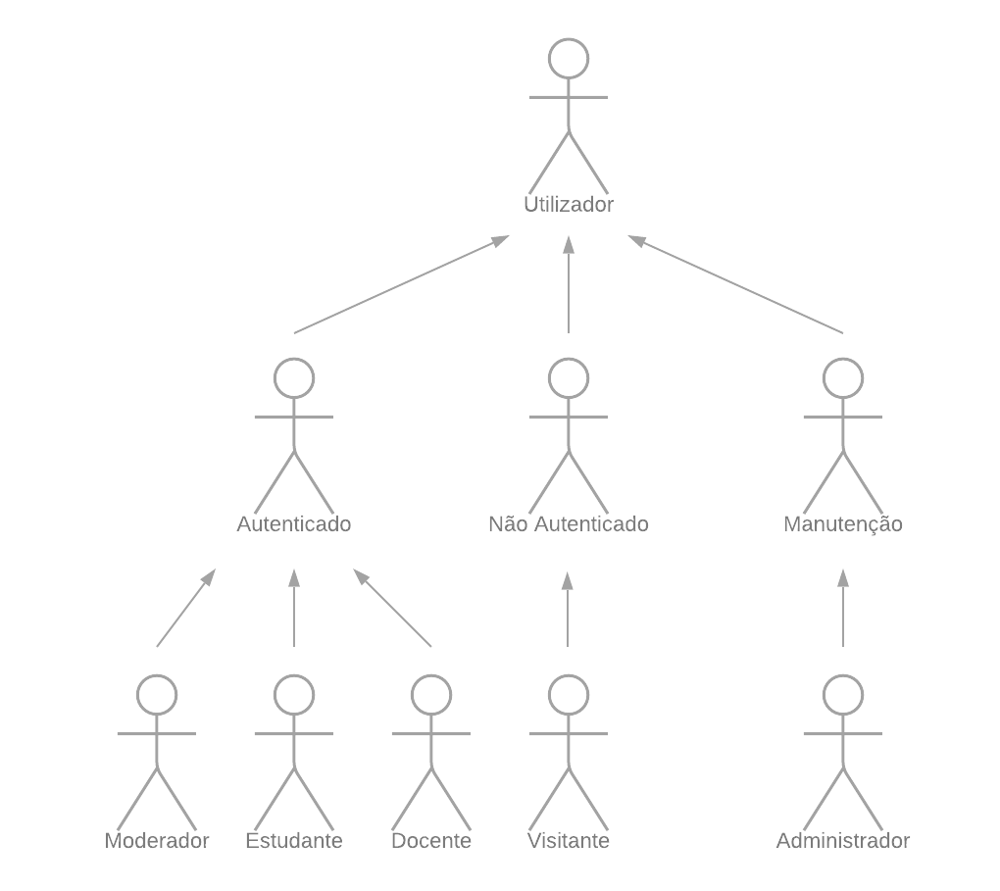

# ER - Especificações de Requerimentos

8 de novembro de 2021

## Tema Geral

Social Networks

## **Autores**

Cristina Pêra

Luís Soares

Mateus Silva

Melissa Silva

### **A1: Noodle**[1.1]

#### **Contexto e Motivação** [1.2]

Almeja-se a criação de uma rede social para dinamizar a comunicação entre todas as entidades que frequentem um estabelecimento de ensino superior, mas com foco especial nos alunos e professores.

Denominada *Noodle*, pretende-se criar um meio de partilha de diferentes tipos de materiais (fotos, vídeos, documentos, etc...) entre os utilizadores para facilitar o trabalho em equipa no contexto de projetos de grupo. Ao mesmo tempo, há ainda o incentivo de deixar os alunos criarem conexões além da vida académica através da partilha de conteúdos de lazer (memes, notícias).

Trata-se de um projeto de grande interesse para o estudante universitário comum, mas também para docentes e quaisquer envolvidos num ambiente académico, desde Comissões de Curso a Conselhos Administrativos. **[1.3]**

Tendo em conta os supramencionados, comprometemo-nos a assegurar diferentes níveis de acesso à plataforma (para distinguir estudantes de docentes, por exemplo), manutenção da segurança de informação pessoal (um aluno apenas tem acesso às suas próprias notas, por exemplo) e também a garantia do senso comum e respeito (atribuição de privilégios de moderador). **[1.4]** Por outro lado, incluir-se-ão funcionalidades básicas esperadas, como possibilidade de pesquisa, criação de grupos de utilizadores e notificações de interação. 

A plataforma providenciará uma experiência de navegação agradável e fácil que se estenda aos mais variados tipos de dispositivos, com uma excelente *user experience*.

#### Objetivos/Metas [2.1-2.2]

- Design Adaptável a Diferentes Dispositivos (PC, Android, Tablet);
- Implementação de um Sistema de Pesquisa (para Utilizadores Públicos, Grupos e Publicações);
- Implementação de um Sistema de Utilizadores;
- Possibilidade de fazer Publicações;
- Criação de Grupos;
- Implementação de Notificações;
  - Notificações Específicas a Utilizador;
  - Notificações de Grupos.

#### **Funcionalidades**

A plataforma incluirá a seguinte lista de funcionalidades implementadas.

1. Sistema de Gestão de Utilizadores
   - Permite banir utilizadores;
   - Permite a imposição de sanções a utilizadores que postem conteúdo de má conduta;

2. Sistema de Utilizadores **[3.1-3.2, 3.4-3.5]**
   - Diferentes Tipos de Acesso, semelhantes a uma hierarquia: Não Autenticado (Visitante) e Autenticado (Estudantes, Moderadores (em contexto de Grupos), Docentes, Administradores) **[3.1-3.2]**;
   - Definições de Privacidade que afetem acesso a conteúdo: um utilizador privado só tem publicações visíveis para os seus colegas/amigos;
   - Criação e Personalização de Perfil Pessoal;
   - Acesso a *Timeline* personalizada;
   - É possível a um utilizador reportar conteúdo de má conduta a Administradores, podendo resultar na aplicação de sanções ou mesmo banimento; 
3. Publicações **[3.1-3.2, 3.4-3.5]**
   - Diferentes Tipos de Publicações: texto (em publicação) e imagem;
   - Dinâmicas de Popularidade:
     - *Gostos*;
     - *Comentários*;
   - Restrições de Visibilidade: restringir a amigos, a elementos de um grupo de que o utilizador faz parte ou público.
   - Possibilidade de Remover ou Editar Publicações;
4. Sistema de Pesquisa **[3.3-3.5]**
   - Busca de Utilizadores Públicos (por nome);
   - Busca de Publicações (por termos incluídos).
5. Grupos **[3.1-3.2, 3.4-3.5]**
   - Personalização do Grupo: nome de grupo, descrição, ícone de identificação;
   - Envio de Convites a outros utilizadores para inclusão num grupo;
   - Níveis de Responsabilidade: Moderadores possuem mais controlo que Estudantes;
   - Definições de Privacidade: grupos privados só têm o seu conteúdo visível para os seus integrantes;
     - Grupos públicos permitem a visualização do seu conteúdo mesmo a quem não está no grupo - é, contudo, necessário, pedir/receber convite para dar entrada;
     - Todos os membros de um grupo podem ver os membros deste;
   - Criação de Eventos (ex.: Datas de Entrega).
6. Notificações **[3.1-3.2, 3.4-3.5]**
   - Específicas a Utilizador
     - Pedidos de Amizade/Colegas;
     - Notificações de Publicações:
       - *Gostos*
       - *Comentários*;
   - Específicas a Membros de um Grupo
     - Notificações de Convites: convites recebidos ou respostas de convites enviados ;
     - Notificações de Novas Publicações;
     - Notificações de Eventos.

#### **Grupos de Acesso**

A respeito de utilizadores, existem dois grandes grupos de utilizadores que consideraremos **[4.1]**:

1. Utilizadores Não Autenticados
   - Não possuirão acesso à maioria das funcionalidades descritas acima, podendo aceder a uma *timeline* de publicações populares e ao sistema de pesquisa de uma forma limitada: todo o conteúdo é limitado a um número pequeno de publicações - interação com qualquer uma ou tentar ir além das mostradas irá pedir que o utilizador se autentique; **[4.2-4.3]**.
   - Uma única categoria: Visitantes **[4.5]**.
2. Utilizadores Autenticados
   - Capazes de acederem a um conjunto de funcionalidades comuns a qualquer utilizador: *timeline* privado, todos os privilégios de grupos a que pertençam (isto inclui a criação destes), possibilidade de se tornar *colegas*/amigos de outros utilizadores e aba de notificações **[4.2-4.3]**;
   - Subdividem-se em quatro categorias:
     - Estudantes: o utilizador autenticado com menor privilégio - não passa dos limites do que lhe é pessoal;
     - Moderadores: existente apenas em contexto de grupo, sendo um privilégio atribuído a um ou mais membros Estudantes e apenas a um Docente;
     - Docentes/Professores: semelhantes a Estudantes, mas possuem acesso a dados de Estudantes que façam parte de grupos dos quais seja Moderador;
     - Administradores: acesso máximo a todos os dados para efeitos de manutenção da plataforma **[4.4]**;

### A2: Atores e Histórias de Utilizador [1.1-1.2]

#### Atores

Para o sistema da plataforma *Noodle*, os atores estão representados na Figura 1 abaixo e descritos na Tabela 1.

<b>Figura 1</b> - Diagrama de Atores[2.1-2.4]

|               **Identificador**                | **Descrição**                                                |
| :--------------------------------------------: | :----------------------------------------------------------- |
|                   Utilizador                   | Utilizador geral que possui acesso ao site - por defeito, é *Não Autenticado*. |
| **Utilizador Não Autenticado**[3.7] | **Grupo de utilizadores com acesso limitado ao site.**       |
|           Visitante[3.8]            | Utilizador não autenticado que possui acesso a versões limitadas do site – por exemplo, a um *timeline* de publicações populares. |
|   **Utilizador Autenticado**[3.9]   | **Grupo de utilizadores que pode ver perfis públicos de outros utilizadores autenticados, fazer publicações (e mandar mensagens).** |
|                   Estudante                    | Utilizador autenticado com acesso a conteúdo personalizado e a todas as funcionalidades (destinadas a si). |
|                    Docente                     | Utilizador autenticado com acesso a conteúdo personalizado (como um Estudante), mas com algumas funcionalidades específicas. |
|                 **Manutenção**                 | **Grupo de utilizadores com grau de acesso mais elevado.**   |
|                   Moderador                    | Utilizador autenticado (Docente ou Estudante) com acesso a funcionalidades específicas a um dos grupos que integre. |
|         Administrador[3.10]         | Utilizador autenticado (pode ser Docente) com acesso a gestão de publicações, grupos, perfis e outras ferramentas de gestão dos outros atores e suas atividades. |

<b>Tabela 1</b> - Atores[3.1-3.6, 3.11-3.12]

#### **Histórias de Utilizador** [4.1-4.10]

Para o sistema *Noodle*, considerem-se as seguintes histórias de utilizador, apresentadas nas secções seguintes.

##### Visitante

| Identificador | Nome                            | Prioridade | Descrição                                                    |
| ------------- | ------------------------------- | ---------- | ------------------------------------------------------------ |
| US01          | Iniciar Sessão[4.11] | Alta       | Enquanto *Visitante*, quero autenticar-me no sistema para aceder a informação privilegiada. |
| US02          | Registar                        | Alta       | Enquanto *Visitante*, quero registar-me no sistema para permitir autenticação no sistema. |
| US03          | Ver Tendências                  | Alta       | Enquanto *Visitante*, quero poder presenciar um *timeline* de publicações populares que me dêem uma imagem do que é ser um Utilizador Autenticado. |
| US04          | Ver FAQ                         | Alta       | Enquanto *Visitante*, quero poder aceder à pagina de FAQs que possam esclarecer dúvidas minhas sobre a equipa e funcionamento do site. |
| US05          | Ver Sobre Nós                   | Alta       | Enquanto *Visitante*, desejo poder aceder à página de informação geral sobre a plataforma *Noodle* e os seus criadores. |
| US06          | Pesquisa                        | Alta       | Enquanto *Visitante*, quero poder aceder a versões limitadas de publicações e perfis, pesquisando por termos presentes neles. |
| US07          | Recuperar Password              | Alta       | Enquanto *Visitante*, quero poder repor a *password* da minha conta de modo a puder autenticar-me. |
| US08          | Ver Funcionalidades Principais  | Alta       | Enquanto *Visitante*, desejo poder visualizar as funcionalidades principais da aplicação. |
| US09          | Ver Contactos                   | Alta       | Enquanto *Visitante*, quero poder ver os contactos dos criadores da aplicação. |

<b>Tabela 2 -</b> História de Utilizadores <i>Visitante</i>

##### Utilizador Autenticado

| Identificador | Nome                                          | Prioridade | Descrição                                                    |
| ------------- | --------------------------------------------- | ---------- | ------------------------------------------------------------ |
| US11          | Terminar Sessão[4.12]              | Alta       | Enquanto *Utilizador Autenticado*, desejo poder terminar a minha sessão no site para impedir acessos inautorizados. |
| US12          | Ver Página Inicial                            | Alta       | Como *Utilizador Autenticado*, desejo aceder à página inicial, onde se encontra o meu *timeline.* |
| US13          | Ver Aba de Notificações                       | Alta       | Enquanto *Utilizador Autenticado* quero poder ver as notificações para não perder acesso a informação que desejam que chegue a mim. Estas notificações incluem publicações feitas por colegas, *Utilizadores Autenticados* que gostem ou comentem as minhas publicações e pedidos de amizade recebidos. |
| US14          | Ver Definições                                | Alta       | Como *Utilizador Autenticado*, desejo ver a página de definições para proceder a quaisquer alterações necessárias para uma melhor experiência. |
| US15          | Apagar Conta[4.14]                 | Alta       | Como *Utilizador Autenticado*, desejo poder agendar a remoção da minha conta caso não pretenda usá-la mais. |
| US16          | Ver Perfil[4.13]                   | Alta       | Como *Utilizador Autenticado*, desejo ver o meu próprio perfil, para ver como outros *Utilizadores Autenticados* o vêem. |
| US17          | Editar Perfil[4.13]                | Alta       | Como *Utilizador Autenticado*, desejo poder editar o conteúdo do meu perfil a meu gosto, incluindo dados pessoais e foto de perfil e capa. |
| US18          | Pesquisa[4.15]                     | Alta       | Como *Utilizador Autenticado*, desejo poder utilizar a ferramenta de pesquisa à procura de publicações, grupos, outros utilizadores ou comentários. |
| US19          | Fazer Publicação                              | Alta       | Como *Utilizador Autenticado*, desejo poder partilhar informação a partir de publicações próprias. |
| US110         | Editar Publicação[4.14]            | Alta       | Como *Utilizador Autenticado*, desejo poder editar uma publicação para corrigir erros que possam comprometer a informação que quero transmitir. |
| US111         | Gostar Publicação                             | Alta       | Como *Utilizador Autenticado*, desejo poder gostar de uma publicação, dando a entender que a vi ao *Utilizador Autenticado* que a fez. |
| US112         | Comentar Publicação                           | Alta       | Como *Utilizador Autenticado*, desejo comentar numa publicação, quer para comunicar com o seu *Utilizador Autenticado* autor ou outro *Utilizador Autenticado* que a tenha comentado. |
| US113         | Reportar Publicação                           | Médio      | Como *Utilizador Autenticado*, desejo poder reportar publicações cujo conteúdo seja de má conduta. |
| US114         | Responder A Comentário                        | Alta       | Como *Utilizador Autenticado*, desejo poder responder a um comentário de uma publicação, mantendo a minha comunicação com o seu autor separada. |
| US115         | Reportar Comentário                           | Médio      | Como *Utilizador Autenticado*, desejo poder reportar um comentário com conteúdo de má conduta, para ser apagado. |
| US116         | Apagar Publicação[4.14]            | Alta       | Como *Utilizador Autenticado*, desejo poder apagar publicações feitas por mim. |
| US117         | Apagar Comentário[4.14]            | Alta       | Como *Utilizador Autenticado*, desejo poder apagar comentários feitos por mim. |
| US118         | Desfazer Gosto em Publicação[4.14] | Alta       | Como *Utilizador Autenticado*, desejo poder desfazer *Gosto*s em publicações. |
| US119         | Criar Grupo de Lazer[1]            | Alta       | Como *Utilizador Autenticado*, desejo poder criar Grupos de Lazer para partilhar com outros colegas. |
| US120         | Marcar Notificações como Vistas               | Alta       | Como *Utilizador Autenticado*, quero poder marcar as minhas notificações como vistas de modo a que estas desapareçam da minha aba de Notificações e páginas de Notificações. |
| US121         | Enviar Pedidos de Amizade                     | Alta       | Como *Utilizador Autenticado*, desejo poder mandar pedidos de amizade a outros *Utilizadores Autenticados* de modo a abrir a possibilidade de nos tornarmos-nos colegas. |
| US122         | Aceitar Pedidos de Amizade                    | Alta       | Como *Utilizador Autenticado*, quero poder aceitar pedidos de amizade para estabelecer uma relação de colegas com o utilizador que me enviou o pedido. |
| US123         | Rejeitar Pedidos de Amizade                   | Alta       | Como *Utilizador Autenticado*, quero poder rejeitar pedidos de amizade. |
| US124         | Gostar de Comentários                         | Alta       | Como *Utilizador Autenticado*, desejo poder gostar de um comentário, dando a entender que o vi ao *Utilizador Autenticado* que a fez. |
| US125         | Ver Membros de um Grupo                       | Alta       | Como *Utilizador Autenticado*, posso visualizar os membros de um Grupo Público de modo a verificar se desejo pedir para me juntar a este. Caso o Grupo seja Privado, apenas posso fazer isto caso pertença ao Grupo. |
| US126         | Enviar Pedido a Grupo                         | Alta       | Como *Utilizador Autenticado*, quero poder enviar um pedido ao *Moderador* de um Grupo ao qual desejo me juntar para ver se este me adiciona à lista de Membros do Grupo. |
| US127         | Funcionalidades da Publicação no Grupo        | Alta       | Como *Utilizador Autenticado* membro de um Grupo, desejo poder fazer, editar e apagar publicações no Grupo ao qual pertenço. |
| US128         | Funcionalidades do Comentário no Grupo        | Alta       | Como *Utilizador Autenticado* membro de um Grupo, desejo poder fazer, editar e apagar comentários no Grupo ao qual pertenço. |
| US129         | Funcionalidades do Gosto no Grupo             | Alta       | Como *Utilizador Autenticado* membro de um Grupo, desejo poder fazer e apagar gostos em publicações e comentários existentes no Grupo ao qual pertenço. |
| US130         | Sair do Grupo                                 | Alta       | Como *Utilizador Autenticado* membro de um Grupo, quero ter a possibilidade de sair deste. |
| US131         | Criar Grupo de Trabalho[1]         | Alta       | Como *Utilizador Autenticado*, desejo poder criar Grupos de Trabalho para partilhar com outros colegas. |

[1] Criando um grupo, sou *Moderador*.

<b>Tabela 3 -</b> História de Utilizadores <i>Autenticados</i>

##### Estudante

| Identificador | Nome                      | Prioridade | Descrição                                                    |
| ------------- | ------------------------- | ---------- | ------------------------------------------------------------ |
| US21          | Aderir a Grupo            | Alta       | Como *Estudante* desejo poder aderir a grupos públicos com *Estudantes* que conheça. |
| US22          | Pedir Adesão a Grupo      | Alta       | Como *Estudante,* desejo poder aderir a um grupo privado pedindo permissão ao seu *Moderador*. |
| US23          | Pedir Acesso de Moderador | Média      | Como *Estudante* num grupo, desejo poder tornar-me *Moderador Estudante* de um grupo para o poder gerir. |

[1] Criando um grupo, sou *Moderador Estudante*.

<b>Tabela 4 -</b> História de Utilizadores <i>Estudantes</i>

##### Docente

| Identificador | Nome                | Prioridade | Descrição                                                    |
| ------------- | ------------------- | ---------- | ------------------------------------------------------------ |
| US31          | Associar-se a Grupo | Alta       | Como *Docente,* desejo poder associar-me como *Moderador Docente* a grupos de trabalho de *Estudantes* dos quais seja Professor. |

<b>Tabela 5 -</b> História de Utilizadores <i>Docente</i>

##### **Moderador**

| Identificador | Nome                                          | Prioridade | Descrição                                                    |
| ------------- | --------------------------------------------- | ---------- | ------------------------------------------------------------ |
| US41          | Integrar Estudante                            | Alta       | Como *Moderador* de um grupo, desejo poder adicionar outros *Estudantes*. |
| US42          | Convidar Docente Moderador                    | Alta       | Como *Moderador* de um grupo, desejo poder convidar o meu professor a ser *Docente Moderador* do meu grupo de trabalho. |
| US43          | Ceder Privilégio de Moderador                 | Média      | Como Moderador de um grupo, desejo poder ceder os meus privilégios de *Moderador* a outro *Estudante* ou *Docente* que queira tomar o meu lugar. |
| US44          | Apagar Publicação                             | Alta       | Como *Moderador* de um grupo, desejo poder apagar publicações feitas por qualquer Estudante no grupo que não sejam adequadas. |
| US45          | Apagar Comentário                             | Alta       | Como *Moderador* de um grupo, desejo poder apagar comentários feitos por qualquer Estudante no grupo que não sejam adequados. |
| US46          | Ver e Editar Definições de Grupo              | Alta       | Como *Moderador*, desejo poder aceder às definições do Grupo garantindo boas práticas entre *Estudantes* e verificando detalhes. Posso também mudar a visibilidade do Grupo (torná-lo privado ou público). |
| US47          | Aceitar Pedidos de Utilizadores Autenticados  | Alta       | Como *Moderador*, quero poder aceitar pedidos de *Utilizadores Autenticados* para que estes passem a fazer parte da lista de Membros do meu Grupo. |
| US48          | Rejeitar Pedidos de Utilizadores Autenticados | Alta       | Como *Moderador*, quero poder rejeitar pedidos de *Utilizadores Autenticados* para os impedir de se tornarem membros do meu Grupo. |

<b>Tabela 6 -</b> História de Utilizadores <i>Moderador Estudante</i>

##### **Administrador[4.16]**

| Identificador | Nome              | Prioridade | Descrição                                                    |
| ------------- | ----------------- | ---------- | ------------------------------------------------------------ |
| US51          | Validar Registos  | Alta       | Como *Administrador* do site, posso aceitar novos registos no site. |
| US52          | Apagar Publicação | Alta       | Como *Administrador* do site, posso apagar qualquer publicação não adequada. |
| US53          | Apagar Grupo      | Alta       | Como *Administrador* do site, posso apagar qualquer grupo não adequado. |
| US54          | Apagar Perfil     | Alta       | Como *Administrador* do site, posso apagar qualquer perfil não adequado. |
| US55          | Apagar Comentário | Alta       | Como *Administrador* do site, posso apagar qualquer comentário não adequado. |
| US56          | Atribuir Sanção   | Média      | Como *Administrador* do site, posso sancionar qualquer utilizador que tenha agido com má conduta. |
| US57          | Banir Utilizador  | Média      | Como *Administrador* do site, posso banir Utilizadores do site por múltiplas ocorrências de má conduta, impedindo-o, por período de tempo indefinido, de fazer o que quer que seja senão Iniciar Sessão. |
| US58          | Repor Utilizador  | Média      | Como *Administrador* do site, posso repor um Utilizador posteriormente banido, dando-lhe de novo os seus direitos. |

<b>Tabela 7 -</b> História de Utilizadores <i>Administrador</i>

#### **Requisitos Suplementares**

##### *Business Rules*[5.1]

| **Identificador** | Nome                                           | Descrição                                                    |
| ----------------- | ---------------------------------------------- | ------------------------------------------------------------ |
| BR01              | Privacidade de Perfil                          | Um perfil pode ser público ou privado - um perfil privado só é vísivel na íntegra a colegas. |
| BR02              | Privacidade de Grupos                          | Um grupo pode ser público ou privado - um grupo privado só tem o seu conteúdo visível para membros. |
| BR03              | Interagir com Conteúdo Próprio[5.2] | Um utilizador autenticado pode comentar ou gostar em publicações das quais é autor. |
| BR04              | Privacidade de Publicações                     | Uma publicação privada só pode ser vista pelos colegas do seu utilizador-autor. |
| BR05              | Banimento de Conta[5.3]             | Trata-se da maior sanção possível por má conduta. Um utilizador banido não pode fazer nada senão iniciar sessão. |
| BR06              | Remoção de Conta                               | Todos os dados criados por uma dada conta são colocados privados aquando a sua remoção. |
| BR07              | Sanções                                        | As sanções para um utilizador tendem a ser apagar conteúdo publicado por este. |
| BR08              | Tipos de Grupos                                | Existem dois tipos de grupos: *Grupos de Lazer* são para serem partilhados entre utilizadores como meio de descontração, *Grupos de Trabalho* são grupos que permitem comunicação entre *Estudantes* (e um *Docente*) para realização de um trabalho académico. |
| BR09              | Moderador Estudante de um Grupo de Trabalho    | Um grupo de trabalho só pode ter um *Moderador Estudante*, capaz de editar os atributos do grupo, gerir conteúdo e aceitar novos membros. |
| BR10              | Moderador Docente de um Grupo de Trabalho      | Um grupo de trabalho só pode ter um *Moderador Docente*, capaz de ver todos os atributos e conteúdo do grupo para efeitos de avaliação. |
| BR11              | Moderador de um Grupo de Lazer                 | Um grupo de lazer pode ter dois *Moderadores* (*Estudantes* e/ou *Docentes*) com capacidade de editar os atributos do grupo, gerir o seu conteúdo e aceitar novos membros. |
| BR12              | Data-Tempo[5.4]                     | A data-tempo da remoção de uma conta é sempre após a data-tempo da sua criação. |
| BR13              | Deleção Propagada de Comentários               | A deleção de um comentário implica a remoção de todas as respostas que este tenha recebido. |
| BR14              | Contas Duplicadas                              | Não podem existir utilizadores com mais que um perfil ativo. Duplicados não serão permitidos. |
| BR15              | Ser Colega                                     | Permite criar uma ligação entre utilizadores que se conheçam - como "amigos" da rede social *Facebook*. |

<b>Tabela 8 -</b> <i>Business Rules</i>

#### Requisitos Técnicos[5.5]

| Identificador | **Nome**                            | **Descrição**                                                |
| ------------- | ----------------------------------- | ------------------------------------------------------------ |
| **TR01**      | **Disponibilidade**[5.6] | O sistema deverá estar disponível a 99% do tempo em cada período de 24 horas. |
| TR02          | Acessibilidade                      | O sistema deverá garantir que todos conseguem aceder às páginas, independentemente de possuírem limitações de acesso ou não, ou do navegador *web* usado. |
| TR03          | Usabilidade                         | O sistema deverá ser simples e fácil de usar. O sistema de *Noodle* deverá ser desenhado para ser usado por utilizadores de qualquer idade e qualquer grau de experiência técnica. |
| TR04          | Desempenho                          | O sistema deverá possuir tempos de resposta menores que 2s para garantir a atenção do utilizador. |
| TR05          | Aplicação Web                       | O sistema deverá ser implementado enquanto aplicação web de páginas dinâmicas (HTML5, JavaScript, CSS3 e PHP). É crítico que o sistema da plataforma *Noodle* seja acessível sem necessidade de instalação de software específico, adotando tecnologias *web* standard. |
| TR06          | Portabilidade                       | O lado servidor do sistema deverá ser suportado por múltiplas plataformas (Linux, Mac OS, etc.). O sistema é destinado para uso pessoal e coletivo. Atingir independência à plataforma usada facilitará a sua disponibilização a um grande número de utilizadores. |
| TR07          | Base de Dados                       | O *PostgreSQL* deverá ser o sistema de gestão de bases de dados usado, em versão de 11 ou mais recente. |
| **TR08**      | **Segurança[5.6]**       | O sistema deverá proteger informação de acessos inautorizados através de um sistema de autenticação e verificação. |
| TR09          | Robustez                            | O sistema deverá estar preparado para lidar e manter-se operacional quando ocorrerem erros de *runtime*. |
| **TR10**      | **Escalabilidade[5.6]**  | O sistema deverá estar preparado para lidar com o crescimento no número de utilizadores e das suas ações. |
| TR11          | Ética                               | O sistema deverá respeitar os princípios éticos do desenvolvimento de software (por exemplo, detalhes pessoais de um utilizador ou dados de utilização não podem ser coletados ou partilhados sem dar conhecimento e pedir permissão ao seu proprietário). |
| TR12          | Suporte de Conteúdo Digital         | Os conteúdos passíveis de serem incluídos em publicações são: texto, imagem (.JPEG, .PNG, .GIF), vídeo (.mp4), áudio (.mp3) e documentos (.pdf e .docx). |

<b>Tabela 9 -</b> <i>Requisitos Técnicos</i>

Considerámos principais os requisitos técnicos **TR01**, **TR08** e **TR10**.

Acreditamos que um sistema fornecido a um estabelecimento de ensino deva estar sempre disponível, sobretudo devido ao cariz da nossa plataforma (em que uma das funcionalidades é a criação de grupos para contexto de trabalho).

Por outro lado, segurança é necessária para que ninguém mal intencionado fora do ecossistema de um sistema de ensino possa aceder a informação privilegiada (como a média de um estudante).

Finalmente, a escalabilidade é relevante para conseguir albergar um número em constante crescimento de estudantes ou mesmo de docentes. 

#### Restrições[5.7]

| Identificador | **Nome**               | Descrição                                                    |
| ------------- | ---------------------- | ------------------------------------------------------------ |
| C01           | Data de Entrega        | O sistema deverá estar pronto para uso no início de fevereiro de 2022.[1] |
| C02           | Poder da Base de Dados | A base de dados deverá ter capacidade de suportar toda a quantidade de dados necessária para o sistema. |

[1] A data de entrega do trabalho é a 24 de janeiro de 2022.

<b>Tabela 10 -</b> <i>Restrições</i>

### **A3: Arquitetura de Informação[1.1-1.2]**

Nesta secção especificaremos melhor os diferentes blocos necessários para o funcionamento da plataforma que pretendemos desenvolver. 

O sistema para a plataforma *Noodle* possui quatro áreas principais:

- as **Páginas Estáticas** possuem informação geral sobre o sistema;
- as **Páginas do Utilizador Autenticado** incluem todas as páginas personalizadas ao utilizador, desde o seu *Timeline Principal* e às *Definições*;
- as páginas de **Gestão de Grupos** permitem a criação de grupos e visualização daqueles a que um utilizador pertença - também por estas os *Moderadores* poderão exercer as suas funções;
- a página de **Manutenção** permite aos *Administradores* do *site* a sua gerência.

<b>Figura 2 -</b> <i>Sitemap</i> da plataforma <i>*Noodle*</i>.[3.1-3.13]

Abaixo, deixamos três figuras diferentes com *wireframes* das três páginas que considerámos principais à plataforma: a página inicial para um visitante, a página inicial de um utilizador autenticado com o seu *timeline* personalizado e um perfil enquanto visto pelo seu detentor.[4.1-4.7]

<b>Figura 3 -</b> <i>Wireframe</i> 1 - Página Inicial para um Visitante.

<b>Figura 4 -</b> <i>Wireframe</i> 2 - Página Inicial de um Utilizador Autenticado com <i>Feed</i> Personalizado.

<b>Figura 5 -</b> <i>Wireframe</i> 3 - Perfil do Utilizador enquanto visto pelo próprio.
### **Histórico de Revisões**
### **Histórico de Revisões**

Mudanças feitas à primeira submissão:

1. Não são aceites tantos tipos de publicações como anunciado na primeira submissão, apenas texto e imagens;
2. Adição de US07, US08, US09, US120, US121, US122, US123, US124, US125, US126, US127, US128, US129, US130, US47, US48, US58;
3. A US13 foi alterada de modo a especificar que tipo de notificações um utilizador recebe;
4. US17 foi alterada para chamar atenção à inclusão de suportes de imagens no perfil do utilizador;
5. US18 foi alterada para adicionar comentários na lista de objetos que é possível pesquisar por;
6. US46 foi alterada para fazer referência para o facto que é possível mudar a visibilidade de um grupo;
7. BR06 foi alterada de modo a ir de encontro com o que é pedido em "*Common Requirements*";
7. Eliminação de US21 para a sua adição na tabela de *User Stories* para *Utilizadores Autenticados* pois decidimos que esta funcionalidade devia estar disponível para todos os utilizadores.
7. As *business rules* BR07 e BR05 foram alteradas para refletir as novas decisões tomadas acerca de sanções e banimentos.

