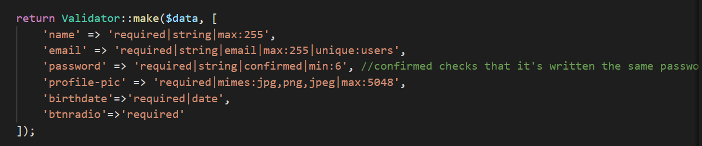

# PA - Produto e Apresentação

28 de janeiro de 2022

## Tema Geral

Social Networks

## Autores

Cristina Pêra

Luís Soares

Mateus Silva

Melissa Silva

### A9: Informação do Produto

Nesta secção iremos falar um pouco sobre o nosso produto: como o instalar, como evoluíram as nossas ideias desde o inicio do seu desenvolvimento (componente ER), de quais desistimos e quais implementamos realmente.

#### Instalação

##### Produto Final

O código do produto final está disponível em 
https://git.fe.up.pt/lbaw/lbaw2122/lbaw2152/-/tree/main.

##### Comando Docker para Iniciar Imagem

```bash
docker run -it -p 8000:80 --name=lbaw2152 -e DB_DATABASE="lbaw2152" -e DB_SCHEMA="lbaw2152" -e DB_USERNAME="lbaw2152" -e DB_PASSWORD="argwFykZ" git.fe.up.pt:5050/lbaw/lbaw2122/lbaw2152
```

##### Usar Produto

O produto final está *online* em https://lbaw2152.lbaw.fe.up.pt/

##### Credenciais do Administrador

| Username        | Password |
| --------------- | -------- |
| admin@gmail.com | admin    |

##### Credenciais de um Utilizador Docente

| Username       | Password |
| -------------- | -------- |
| test@gmail.com | password |

##### Credenciais de um Utilizador Estudante

| Username        | Password   |
| --------------- | ---------- |
| test2@gmail.com | password10 |

#### Ajuda na Aplicação

Implementamos ajuda na aplicação através do uso de *tooltips*. Decidimos incluir estas *features* em sítios onde pensamos que um utilizador comum do *website* poderia ficar um pouco confuso acerca de alguma decisão. Escolhemos implementar assim esta funcionalidade nos diversos *radiobuttons* que se encontram na aplicação. Incluímos aqui alguns exemplos:


#### Validação de *Input*

Fazemos a validação do *input* do utilizador com a ajuda de *forms* e da função *validate()* de *Laravel*. Apresentamos, de seguida, exemplos:




Não usamos *validate()* apenas para *input* que é *required*:


#### Verificação de Acessibilidade e Usabilidade

Passamos o nosso website por *checklists* de Acessibilidade e Usabilidade encontradas em https://ux.sapo.pt/checklists/acessibilidade/, https://ux.sapo.pt/checklists/usabilidade/ , respetivamente.

Os nossos resultados estão em:

- Acessibilidade: https://git.fe.up.pt/lbaw/lbaw2122/lbaw2152/-/blob/main/Checklists/Acessibilidade.pdf


- Usabilidade: https://git.fe.up.pt/lbaw/lbaw2122/lbaw2152/-/blob/main/Checklists/Usabilidade.pdf


#### Validação de HTML & CSS

Passamos o nosso website por um validador de HTML e CSS, encontrados em https://validator.w3.org/nu/ e https://jigsaw.w3.org/css-validator/, respetivamente.

Os nossos resultados estão em:

- HTML: https://git.fe.up.pt/lbaw/lbaw2122/lbaw2152/-/tree/main/Checklists/Validation%20Report/HTML%20Validation


- CSS: https://git.fe.up.pt/lbaw/lbaw2122/lbaw2152/-/tree/main/Checklists/Validation%20Report/CSS%20Validation


#### Revisões ao Projeto

Todos os componentes, ER, EBD e EPA, possuem um "Histórico de Revisões" com as alterações feitas a cada um desde da sua submissão.

Nesta secção vamos-nos focar nas alterações feitas à secção A2: "Atores e *User Stories*"  do componente ER, pois pensamos que esta é a causa de todas as outras mudanças feitas. Implementamos a maioria das *US* que propusemos, com algumas exceções: US113, US114, US115, US23, US31, US42, US43 e US51.

US113 e US115 foram descartadas devido a falta de tempo. US114 partilha a mesma razão e também percebemos que seria muito difícil de gerir o *display* das respostas de comentários, visto este ser baseado em indentação.

US23, US31, US42 e US43 estão todas interligadas, pelo que a não implementação de uma, significa a não implementação das restantes. Ao longo do desenvolvimento, para sermos seletivos e cientes do tempo restante, acabamos por perceber que não fazia muito sentido cada grupo ter dois moderadores ou um moderador ceder privilégios de moderador no seu grupo.

US51 não foi implementada simplesmente porque validação de registos trata-se de uma funcionalidade automática e que é feita facilmente em *Laravel*, não precisando de haver qualquer *feedback* do administrador.

Foram adicionadas e implementadas várias US, tais como US07, US08, US09, US120, US121, US122, US123, US124, US125, US126, US127, US128, US129, US130, US47, US48. Estas foram adicionadas de modo a implementar a 100% os requisitos da *checklist* do A9.

Fizemos várias alterações às componentes ligadas à nossa Base de Dados porque, ao tentar testar o nosso código, foi preciso adicionar diversos elementos. Para além disso, descobrimos algumas limitações do *Laravel* que dificultavam a execução à risca do que tínhamos planeado: por exemplo, tínhamos várias tabelas com **PK** (chave primária) composta que acabamos por transformar em **UK** (chave única) composta, devido ao *Laravel Eloquent* não suportar a primeira opção. Retiramos algumas tabelas que já não eram necessárias devido às nossas decisões sobre a implementação das nossas *user stories* e outras por mudanças feitas às multiplicidades, tornando desnecessária uma tabela para representar a informação. 

Fizemos também alterações aos Índices de *full-text search* para incluir *comentários* como um atributo que podemos pesquisar e para adicionar *Full-text search with multiple weighted fields*.

Efetuámos alterações à API desenvolvida no A7, de modo a que este possua todas as *routes* que acabámos por implementar.

É possível observar as alterações em detalhe nos ficheiros *markdown* ER, EBD e EPA.

#### Detalhes de Implementação

##### Bibliotecas Usadas

Não foi utilizada qualquer biblioteca para além do que já estava disponível no *Template* de *Laravel* fornecido.

##### Histórias de Utilizador Implementadas

No sistema da plataforma *Noodle*, as histórias de utilizador implementadas estão descritas na seguinte tabela.

##### Visitante

| Identificador | Nome                           | Prioridade | Descrição                                                    | Estado | Membros do Grupo          |
| ------------- | ------------------------------ | ---------- | ------------------------------------------------------------ | ------ | ------------------------- |
| US01          | Iniciar Sessão                 | Alta       | Enquanto *Visitante*, quero autenticar-me no sistema para aceder a informação privilegiada. | 100%   | Mateus<br />Melissa<br /> |
| US02          | Registar                       | Alta       | Enquanto *Visitante*, quero registar-me no sistema para permitir autenticação nele. | 100%   | Mateus<br />Melissa<br /> |
| US03          | Ver Tendências                 | Alta       | Enquanto *Visitante*, quero poder presenciar um *timeline* de publicações populares que me dêem uma imagem do que é ser um Utilizador Autenticado. | 100%   | Mateus<br />Melissa<br /> |
| US04          | Ver FAQ                        | Alta       | Enquanto *Visitante*, quero poder aceder à pagina de FAQs que possam esclarecer dúvidas minhas sobre a equipa e funcionamento do site. | 100%   | Mateus<br />Melissa<br /> |
| US05          | Ver Sobre Nós                  | Alta       | Enquanto *Visitante*, desejo poder aceder à página de informação geral sobre a plataforma *Noodle* e os seus criadores. | 100%   | Mateus<br />Melissa<br /> |
| US06          | Pesquisa                       | Alta       | Enquanto *Visitante*, quero poder aceder a versões limitadas de publicações e perfis, pesquisando por termos presentes neles. | 100%   | Mateus<br />Melissa       |
| US07          | Recuperar Password             | Alta       | Enquanto *Visitante*, quero poder repor a *password* da minha conta de modo a poder autenticar-me. | 100%   | Mateus<br />Melissa       |
| US08          | Ver Funcionalidades Principais | Alta       | Enquanto *Visitante*, desejo poder visualizar as funcionalidades principais da aplicação. | 100%   | Mateus<br />Melissa<br /> |
| US09          | Ver Contactos                  | Alta       | Enquanto *Visitante*, quero poder ver os contactos dos criadores da aplicação. | 100%   | Mateus<br />Melissa<br /> |

##### Utilizador Autenticado

| Identificador | Nome                                             | Prioridade | Descrição                                                    | Estado | Membros do Grupo                             |
| ------------- | ------------------------------------------------ | ---------- | ------------------------------------------------------------ | ------ | -------------------------------------------- |
| US11          | Terminar Sessão                                  | Alta       | Enquanto *Utilizador Autenticado*, desejo poder terminar a minha sessão no site para impedir acessos inautorizados. | 100%   | Mateus<br />Melissa<br />                    |
| US12          | Ver *Feed* Personalizado                         | Alta       | Como *Utilizador Autenticado*, desejo aceder à página inicial, onde se encontra o meu *timeline.* | 100%   | Mateus<br />Melissa<br />                    |
| US13          | Ver Aba de Notificações / Página de Notificações | Alta       | Enquanto *Utilizador Autenticado* quero poder ver as notificações para não perder acesso a informação que desejam que chegue a mim. Estas notificações incluem publicações feitas por colegas, *Utilizadores Autenticados* que gostem ou comentem as minhas publicações e pedidos de amizade recebidos. | 100%   | Mateus<br />Melissa                          |
| US14          | Ver Definições                                   | Alta       | Como *Utilizador Autenticado*, desejo ver a página de definições para proceder a quaisquer alterações necessárias para uma melhor experiência. | 100%   | Mateus<br />Melissa<br />                    |
| US15          | Apagar Conta                                     | Alta       | Como *Utilizador Autenticado*, desejo poder efetuar a remoção da minha conta caso não pretenda usá-la mais. | 100%   | Mateus<br />Melissa                          |
| US16          | Ver Perfil                                       | Alta       | Como *Utilizador Autenticado*, desejo ver o meu próprio perfil, para ver como outros *Utilizadores Autenticados* o vêem. | 100%   | Mateus<br />Melissa <br />                   |
| US17          | Editar Perfil                                    | Alta       | Como *Utilizador Autenticado*, desejo poder editar o conteúdo do meu perfil a meu gosto, incluindo dados pessoais e foto de perfil e capa. | 100%   | Mateus<br />Melissa<br />                    |
| US18          | Pesquisa                                         | Alta       | Como *Utilizador Autenticado*, desejo poder utilizar a ferramenta de pesquisa à procura de publicações, grupos, outros utilizadores ou comentários. | 100%   | Mateus<br />Melissa                          |
| US19          | Fazer Publicação                                 | Alta       | Como *Utilizador Autenticado*, desejo poder partilhar informação a partir de publicações próprias. | 100%   | Mateus<br />Melissa <br />Luís<br />Cristina |
| US110         | Editar Publicação                                | Alta       | Como *Utilizador Autenticado*, desejo poder editar uma publicação para corrigir erros que possam comprometer a informação que quero transmitir. | 100%   | Mateus<br />Melissa<br />Luís<br />Cristina  |
| US111         | Gostar Publicação                                | Alta       | Como *Utilizador Autenticado*, desejo poder gostar de uma publicação, dando a entender que a vi ao *Utilizador Autenticado* que a fez. | 100%   | Mateus<br />Melissa<br />Luís<br />Cristina  |
| US112         | Comentar Publicação                              | Alta       | Como *Utilizador Autenticado*, desejo comentar numa publicação, quer para comunicar com o seu *Utilizador Autenticado* autor ou outro *Utilizador Autenticado* que a tenha comentado. | 100%   | Mateus<br />Melissa<br />Luís<br />Cristina  |
| US116         | Apagar Publicação                                | Alta       | Como *Utilizador Autenticado*, desejo poder apagar publicações feitas por mim. | 100%   | Mateus<br />Melissa<br />Luís<br />Cristina  |
| US117         | Apagar Comentário                                | Alta       | Como *Utilizador Autenticado*, desejo poder apagar comentários feitos por mim. | 100%   | Mateus<br />Melissa<br />Luís<br />Cristina  |
| US118         | Desfazer Gosto em Publicação                     | Alta       | Como *Utilizador Autenticado*, desejo poder desfazer *Gosto*s em publicações. | 100%   | Mateus<br />Melissa                          |
| US119         | Criar Grupo de Lazer<sup>[1]</sup>               | Alta       | Como *Utilizador Autenticado*, desejo poder criar Grupos de Lazer para partilhar com outros colegas. | 100%   | Mateus<br />Melissa<br />                    |
| US120         | Marcar Notificações como Vistas                  | Alta       | Como *Utilizador Autenticado*, quero poder marcar as minhas notificações como vistas de modo a que estas desapareçam da minha aba de Notificações e página de Notificações. | 100%   | Mateus<br />Melissa                          |
| US121         | Enviar Pedidos de Amizade                        | Alta       | Como *Utilizador Autenticado*, desejo poder mandar pedidos de amizade a outros *Utilizadores Autenticados* de modo a abrir a possibilidade de nos tornarmos colegas. | 100%   | Mateus<br />Melissa                          |
| US122         | Aceitar Pedidos de Amizade                       | Alta       | Como *Utilizador Autenticado*, quero poder aceitar pedidos de amizade para estabelecer uma relação de colegas com o utilizador que me enviou o pedido. | 100%   | Mateus<br />Melissa                          |
| US123         | Rejeitar Pedidos de Amizade                      | Alta       | Como *Utilizador Autenticado*, quero poder rejeitar pedidos de amizade. | 100%   | Mateus<br />Melissa                          |
| US124         | Gostar de Comentários                            | Alta       | Como *Utilizador Autenticado*, desejo poder gostar de um comentário, dando a entender que o vi ao *Utilizador Autenticado* que a fez. | 100%   | Mateus<br />Melissa                          |
| US125         | Ver Membros de um Grupo                          | Alta       | Como *Utilizador Autenticado*, posso visualizar os membros de um Grupo Público de modo a verificar se desejo pedir para me juntar a este. Caso o Grupo seja Privado, apenas posso fazer isto caso pertença ao Grupo. | 100%   | Mateus<br />Melissa                          |
| US126         | Enviar Pedido a Grupo                            | Alta       | Como *Utilizador Autenticado*, quero poder enviar um pedido ao *Moderador* de um Grupo ao qual desejo juntar-me para ver se este me adiciona à lista de Membros do Grupo. | 100%   | Mateus<br />Melissa                          |
| US127         | Funcionalidades da Publicação no Grupo           | Alta       | Como *Utilizador Autenticado* membro de um Grupo, desejo poder fazer, editar e apagar publicações no Grupo ao qual pertenço que sejam minhas. | 100%   | Mateus<br />Melissa                          |
| US128         | Funcionalidades do Comentário no Grupo           | Alta       | Como *Utilizador Autenticado* membro de um Grupo, desejo poder fazer, editar e apagar comentários no Grupo ao qual pertenço que sejam minhas. | 100%   | Mateus<br />Melissa                          |
| US129         | Funcionalidades do Gosto no Grupo                | Alta       | Como *Utilizador Autenticado* membro de um Grupo, desejo poder fazer e apagar gostos em publicações e comentários existentes no Grupo ao qual pertenço. | 100%   | Mateus<br />Melissa                          |
| US130         | Sair do Grupo                                    | Alta       | Como *Utilizador Autenticado* membro de um Grupo, quero ter a possibilidade de sair deste. | 100%   | Mateus<br />Melissa                          |
| US131         | Criar Grupo de Trabalho<sup>[1]</sup>            | Alta       | Como *Utilizador Autenticado*, desejo poder criar Grupos de Trabalho para partilhar com outros colegas. | 100%   | Mateus<br />Melissa                          |

<sup>[1]</sup> Criando um grupo, sou *Moderador*.

##### Estudante

| Identificador | Nome                 | Prioridade | Descrição                                                    | Estado | Membros do Grupo    |
| ------------- | -------------------- | ---------- | ------------------------------------------------------------ | ------ | ------------------- |
| US21          | Aderir a Grupo       | Alta       | Como *Estudante* desejo poder aderir a grupos públicos com *Estudantes* que conheça pedindo permissão ao seu *Moderador*. | 100%   | Mateus<br />Melissa |
| US22          | Pedir Adesão a Grupo | Alta       | Como *Estudante,* desejo poder aderir a um grupo privado pedindo permissão ao seu *Moderador*. | 100%   | Mateus<br />Melissa |

##### Moderador

| Identificador | Nome                                          | Prioridade | Descrição                                                    | Estado | Membros do Grupo          |
| ------------- | --------------------------------------------- | ---------- | ------------------------------------------------------------ | ------ | ------------------------- |
| US41          | Integrar Estudante                            | Alta       | Como *Moderador* de um grupo, desejo poder adicionar outros *Estudantes* enviando-lhes um convite para que entrem ou aceitando pedidos de entrada destes. | 100%   | Mateus<br />Melissa       |
| US44          | Apagar Publicação                             | Alta       | Como *Moderador* de um grupo, desejo poder apagar publicações feitas por qualquer Estudante no grupo que não sejam adequadas. | 100%   | Mateus<br />Melissa<br /> |
| US45          | Apagar Comentário                             | Alta       | Como *Moderador* de um grupo, desejo poder apagar comentários feitos por qualquer Estudante no grupo que não sejam adequados. | 100%   | Mateus<br />Melissa       |
| US46          | Ver e Editar Definições de Grupo              | Alta       | Como *Moderador*, desejo poder aceder às definições do Grupo garantindo boas práticas entre *Estudantes* e verificando detalhes. Posso também mudar a visibilidade do Grupo (torná-lo privado ou público). | 100%   | Mateus<br />Melissa<br /> |
| US47          | Aceitar Pedidos de Utilizadores Autenticados  | Alta       | Como *Moderador*, quero poder aceitar pedidos de *Utilizadores Autenticados* para que estes passam a fazer parte da lista de Membros do meu Grupo. | 100%   | Mateus<br />Melissa       |
| US48          | Rejeitar Pedidos de Utilizadores Autenticados | Alta       | Como *Moderador*, quero poder rejeitar pedidos de *Utilizadores Autenticados* para os impedir de se tornarem membros do meu Grupo. | 100%   | Mateus<br />Melissa       |

##### Administrador

| Identificador | Nome              | Prioridade | Descrição                                                    | Estado | Membros do Grupo          |
| ------------- | ----------------- | ---------- | ------------------------------------------------------------ | ------ | ------------------------- |
| US52          | Apagar Publicação | Alta       | Como *Administrador* do site, posso apagar qualquer publicação não adequada. | 100%   | Mateus<br />Melissa<br /> |
| US53          | Apagar Grupo      | Alta       | Como *Administrador* do site, posso apagar qualquer grupo não adequado. | 100%   | Mateus<br />Melissa<br /> |
| US54          | Apagar Perfil     | Alta       | Como *Administrador* do site, posso apagar qualquer perfil não adequado. | 100%   | Mateus<br />Melissa<br /> |
| US55          | Apagar Comentário | Alta       | Como *Administrador* do site, posso apagar qualquer comentário não adequado. | 100%   | Mateus<br />Melissa       |
| US56          | Atribuir Sanção   | Média      | Como *Administrador* do site, posso sancionar qualquer utilizador que tenha agido com má conduta. | 100%   | Mateus<br />Melissa       |
| US57          | Banir Utilizador  | Média      | Como *Administrador* do site, posso banir Utilizadores do site por múltiplas ocorrências de má conduta, impedindo-o, por qualquer período de tempo, de fazer o que quer que seja no *site* sem ser iniciar sessão. | 100%   | Mateus<br />Melissa       |
| US58          | Repor Utilizador  | Média      | Como *Administrador* do site, posso repor um Utilizador posteriormente banido, dando-lhe de novo os seus direitos. | 100%   | Mateus<br />Melissa       |

### A10: Apresentação

Este artefacto contém informações referentes à apresentação do produto.

#### Apresentação do Produto

Criamos uma rede social intitulada *Noodle*. Esta tem várias funcionalidades, tem um sistema de utilizadores que possuem a possibilidade de criar publicações e reagir a estas com comentários, gostos; podem ainda editar tudo o que criam. Têm também a oportunidade de se conectar com outros utilizadores, enviando-lhes pedidos de "Colega", os quais podem ser aceitados ou recusados. Os utilizadores também recebem notificações, estas são enviadas pelo sistema quando um outro utilizador reage ao conteúdo de um utilizador, quando um dos seus colegas publica algo de novo, ou quando este recebe um pedido de amizade ou para se juntar a um grupo.

Grupos são espaços que reúnem vários utilizadores com interesses em comum, possuem um moderador que é o seu "dono" e que tem poder para editar o grupo, enviar convites a outros utilizadores (quando cria o espaço), de recusar ou aceitar pedidos de outros utilizadores que se querem juntar ao grupo, eliminar qualquer membro, qualquer conteúdo publicado ou até o próprio grupo.  Quem mantém a ordem no *website* são os administradores que têm o poder de banir, repor e eliminar utilizadores, grupos ou conteúdo.

*Noodle* está *online* em https://lbaw2152.lbaw.fe.up.pt/

#### Vídeo

O vídeo de apresentação do nosso produto encontra-se em https://drive.google.com/file/d/1i_pnFiPDLf0XFEy3TH9BPyfk2vtYBO6T/view?usp=sharing. Esforçámo-nos para mostrar o máximo número de funcionalidades no tempo limite que nos foi fornecido.


## Autoavaliação

Link para a spreadsheet: https://docs.google.com/spreadsheets/d/16L6nAgDa9fuEBVlfhYZxvXK0VGgl8F_wYjcHe1pPU3g/edit#gid=1916533523
